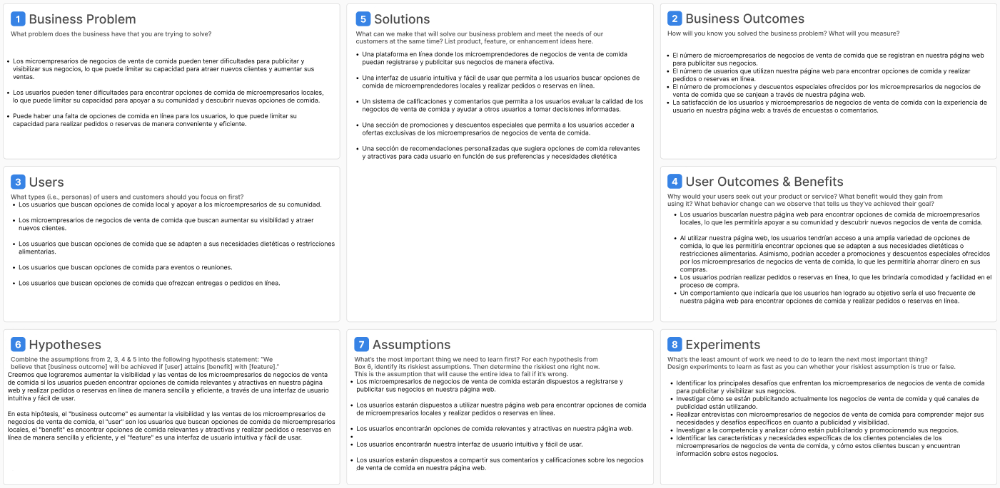
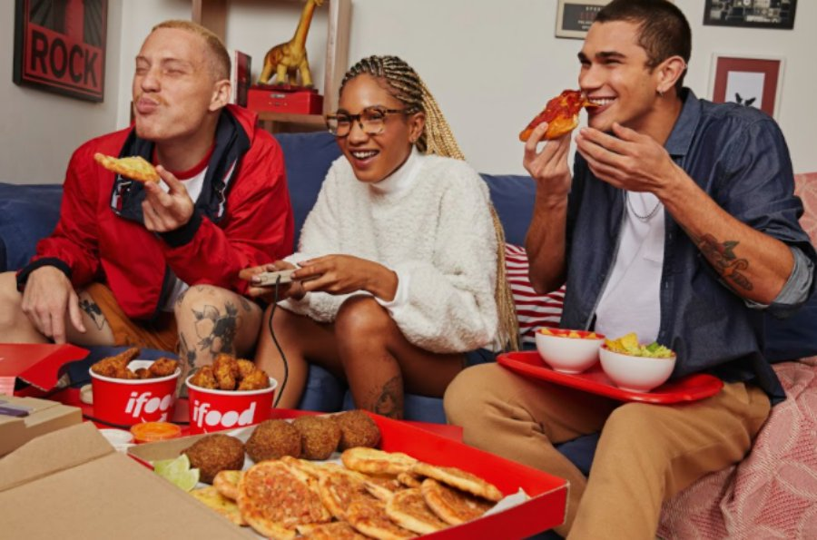
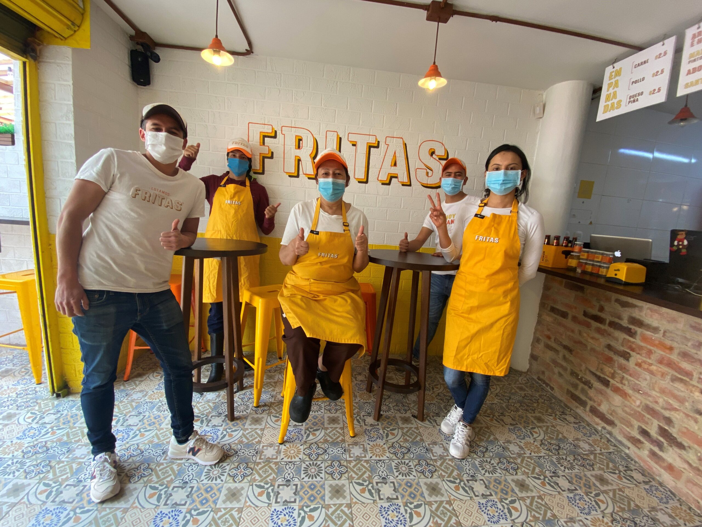

## Introduccion:

 

# 1.1. Startup Profile

### 1.1.1. Descripcion de la Startup  

EmprendeChef es una plataforma web innovadora diseñada exclusivamente para emprendedores culinarios que operan locales pequeños y desean aprovechar oportunidades significativas para impulsar el crecimiento de sus negocios. Nuestro enfoque radica en brindar a los emprendedores de alimentos con establecimientos físicos las herramientas y el alcance necesarios para potenciar sus proyectos y alcanzar nuevas metas. Nuestra plataforma ofrece a estos emprendedores la posibilidad de resaltar frente a los consumidores locales, exhibiendo sus ofertas gastronómicas, precios y horarios de atención. Mediante membresías mensuales personalizadas, adaptadas a cada negocio, permitimos que inclusive aquellos con propuestas de bajo costo aprovechen nuestra plataforma y accedan a una estrategia de promoción integral. Esto abarca desde la visibilidad en nuestra página hasta la promoción en diversas redes sociales. Para los consumidores, ofrecemos la opción de registro y suscripción por tan solo 10 soles, incluyendo beneficios como promociones exclusivas y descuentos en sus lugares de consumo habituales, e incluso presentándose ofertas que podrían interesarles de otros emprendedores. EmprendeChef actúa como el vínculo entre los emprendedores culinarios y sus comunidades locales, facilitando conexiones auténticas y sostenibles, mientras difunde su esencia en cada rincón, tanto virtual como presencial.
 

* **Mision**:  
En EmprendeChef, nos dedicamos a potenciar a emprendedores culinarios en crecimiento en el Perú, proporcionándoles una plataforma integral que destaque sus propuestas gastronómicas únicas. Nuestra misión es brindarles las herramientas y visibilidad necesarias para establecer conexiones sólidas con sus comunidades locales, permitiendo que sus ofertas alcancen a un público más amplio y diverso. A través de nuestra plataforma, aspiramos a impulsar la apreciación por la comida artesanal y local, mientras facilitamos a los consumidores el descubrimiento de experiencias culinarias auténticas y memorables.
* **Vision**:  
Convertirnos en la plataforma líder en el Perú que establece conexiones sólidas entre emprendedores culinarios en crecimiento y sus comunidades locales, siendo reconocidos por ofrecer una experiencia gastronómica única y por superar las expectativas de la competencia.

 

### 1.1.2. Perfiles de integrantes 

| Nombre |Codigo | Descripcion | Foto |             
|--------|-------|------|------|       
|Jesus Antonio Lazo Tapia|U202019038 |Soy estudiante de la carrera de Ing. Software en la UPC. Me gusta todo lo relacionado con la tecnología y sobre el mundillo de la innovación tecnológica que actualmente sigue en constante crecimiento. Me gusta mucho trabajar cuando estamos todos bien sincronizados en el objetivo que queremos para el trabajo.||
|Frezzia Espinoza Paredes|U200815121|Soy estudiante de Ingeniería de Software de UPC. Estoy comprometida con mi grupo para realizar un buen trabajo.||  
|Juan Jose Navarro Chacon |20201F316 |Soy estudiante de la carrera Ingeniería de Software, actualmente estoy cursando el 6to ciclo. Me considero una persona divertida, empática, responsable, creativo, honesta y sobre todo organizado en los planes que deseo realizar. Para el trabajo que vamos a realizar puedo aportar con el desarrollo del sistema, ya que tengo conocimientos del lenguaje de C++, ya que trabaje ciclos anteriores con este lenguaje.||   
|Naggit German Ballona Blas|U20201B895|Actualmente estudiando la carrera de Ingeniería de Software, gracias a esta carrera podré desarrollar aplicaciones multiplataforma generando soluciones informáticas utilizando la inteligencia artificial. Yo como estudiante de esta carrera hasta el momento ya sé manejar el código en C++, python y un poco de java, manejando estructuras, ciclos repetitivos y más. Soy entusiasta, perseverante y gracias a ello podré siempre mantener al equipo unido para cumplir con todas las actividades a tiempo.||  
|Camila Conde Isla|U202114309|Soy estudiante de la carrera de Ingeniería de Software en la cual me encuentro cursando el quinto ciclo de la carrera. Mi motivación para seguir aprendiendo es llegar a crear y diseñar soluciones creativas y entender mejor la tecnología. Me considero una persona creativa, proactiva, tolerante, respetuosa y apasionada por lo que me gusta. Me comprometo a apoyar en el proceso para poder tener un proyecto final bien planteado para obtener una buena nota.||   
 

# 1.2. Solution Profile 

### 1.2.1 Antecedentes y problemática  

1. **What (Qué) ¿Cuál es el problema?**  
   
   El problema es que los emprendedores culinarios con locales pequeños enfrentan dificultades para ampliar su visibilidad y llegar a nuevos clientes. Además, muchas personas desean consumir algún aperitivo pero no cuentan con suficiente presupuesto para acceder a lo ofrecido por los restaurantes y servicios de comida rápida. También, la distancia de la tienda puede hacer que la comida llegue fría o tarde.

2. **When (Cuándo) ¿Cuándo sucede el problema?**  
   
   El problema se presenta constantemente a medida que los emprendedores buscan crecer y expandir sus negocios. Los consumidores no conocen la ubicación de ciertos puestos de comida que puedan estar cerca de su ubicación.

3. **Where (Dónde) ¿Dónde ocurre el problema?**  
   
   - El problema ocurre en el ámbito local, especialmente en el Perú, donde emprendedores culinarios con establecimientos físicos buscan llegar a más consumidores. 
   - Para los consumidores el problema ocurre por su falta de conocimiento en usar las redes sociales para buscar o cuando están en una nueva zona que no conozcan aún.      
 
4. **Who (Quién) ¿Quién es afectado por el problema?**  
   
   Emprendedores culinarios que dirigen locales pequeños y buscan desarrollar sus negocios son los más afectados por este problema.

5. **Why (Por qué) ¿Por qué ocurre el problema?**  
   
   El problema ocurre debido a la falta de herramientas y recursos para que estos emprendedores se conecten efectivamente con su audiencia local y logren un crecimiento sostenible.La falta de apoyo para estos emprendedores es muy alta ya que algunos no saben cómo utilizar las redes sociales para crear un anuncio llamativo de su negocio y que pueda atraer a las personas.

6. **How (Cómo) ¿Cómo resolver el problema?**  
   
   La solución es proporcionar a estos emprendedores una plataforma como EmprendeChef, que les ofrezca herramientas para resaltar sus ofertas gastronómicas, promociones y horarios de atención, conectándose con los consumidores locales y brindándoles visibilidad en línea.

7. **How Much (Cuánto) ¿Cuánto costaría resolver el problema?**  
   - Los emprendedores culinarios pueden acceder a membresías mensuales personalizadas con costos adaptados a la escala de sus negocios. 
   - Para los consumidores, la suscripción tiene un costo de 10 soles, que incluye beneficios como promociones exclusivas y descuentos.

 

### 1.2.2. Lean UX Process  

### 1.2.2.1. Lean UX Problem Statement  

La aplicación fue diseñada con objeto de dar mayor visibilidad a los microemprendedores culinarios que operan en locales pequeños y desean impulsar el crecimiento de sus negocios. Hemos observado que el servicio de venta de comida por parte de los microempresarios queda circunscrito, sobre todo, a los vecinos más cercanos. Es decir, hay clientes potenciales que no conocen del establecimiento de comida por falta de publicidad o visibilidad, una de las causas principales por las que algunas de estas empresas cierran, debido a un rédito insuficiente.

### 1.2.2.2. Lean UX Assumptions

- **Suposición 1:** Los usuarios estarán interesados en encontrar el precio más bajo para los productos que desean comprar.
- **Suposición 2:** Los usuarios encontrarán útil la recomendación de las tiendas más cercanas y las formas de pago aceptadas.
- **Suposición 3:** Los usuarios utilizan aplicaciones o sitios web para comparar precios y buscar promociones y descuentos.
- **Suposición 4:** Los usuarios utilizarán la función de lista de compras para organizar los productos que desean comprar.
- **Suposición 5:** Los usuarios utilizarán la función de filtro por distrito para elegir el negocio de acuerdo su localización.  

### 1.2.2.3. Lean UX Hypothesis Statements

* **Hipótesis 1:** Si proporcionamos a los usuarios una aplicación o sitio web que les permita comparar precios de productos en diferentes tiendas, entonces los usuarios utilizarán activamente la función de búsqueda de precios para encontrar el precio más bajo y tomar decisiones informadas de compra.
  
* **Hipótesis 2:** Si ofrecemos a los usuarios una función de recomendación de tiendas cercanas y opciones de pago en la aplicación o sitio web, entonces los usuarios encontrarán útil esta información y la utilizarán para seleccionar la tienda más conveniente y adecuada para sus necesidades de compra.
  
* **Hipótesis 3:** Si ofrecemos a los usuarios una función de búsqueda de promociones y descuentos en la aplicación o sitio web, entonces los usuarios utilizarán activamente esta función para encontrar ofertas exclusivas y ahorrar dinero en sus compras.
  
* **Hipótesis 4:** Si proporcionamos a los usuarios una función de lista de compras en la aplicación o sitio web, entonces los usuarios utilizarán esta función para organizar los productos que desean comprar y recibir notificaciones sobre cambios de precio o disponibilidad, lo que les ayudará a planificar y realizar compras más eficientes.
  
* **Hipótesis 5:** Si ofrecemos a los usuarios una función para filtrar las recomendaciones por localización o lugar de preferencia, entonces los usuarios la usarán para seleccionar la tienda más adecuada y conveniente para sus necesidades del momento.

### 1.2.2.4. Lean UX Canvas

[Link del Canvas](https://www.figma.com/file/Bd8CFz0ZtFGC5DGWk4hLBf/Lean-UX-Canvas-2.0-(Community)?type=design&node-id=0-1&mode=design&t=1bdzkWSNwtv2F1tv-0)

 

# 1.3. Segmento Objetivo

* **Consumidores:**
  Nuestro segmento de consumidores está formado por personas que buscan opciones gastronómicas convenientes y asequibles para satisfacer sus necesidades de comida y aperitivos. Estos consumidores valoran la autenticidad y la diversidad culinaria local. Sin embargo, a menudo se encuentran con el desafío de ubicar opciones cercanas a su ubicación o de acceder a promociones atractivas. EmprendeChef les brinda la solución perfecta al permitirles descubrir una amplia gama de emprendedores culinarios locales y disfrutar de beneficios exclusivos, promociones y descuentos, todo a través de una plataforma fácil de usar. Para los consumidores, EmprendeChef no solo es una fuente de deliciosas opciones, sino también un acceso directo a experiencias culinarias auténticas y gratificantes.

        

* **Emprendedores:**
  Nuestro segmento de emprendedores de comida está compuesto por aquellos que dirigen pequeños negocios culinarios y desean expandir su alcance y visibilidad. Estos emprendedores son apasionados por la creación de platillos únicos y auténticos, pero a menudo enfrentan desafíos en la promoción efectiva de sus ofertas. EmprendeChef les brinda una plataforma donde pueden presentar sus creaciones culinarias, horarios de atención y promociones de manera llamativa. Para ellos, EmprendeChef es más que una herramienta de marketing; es un recurso estratégico que les permite conectarse directamente con una audiencia que comparte su pasión por la buena comida y que está ávida por descubrir nuevas y deliciosas propuestas en su comunidad local. Con nuestra plataforma, los emprendedores de comida pueden aprovechar al máximo su potencial y alcanzar nuevas alturas en sus negocios.

 

