## Requirements Elicitation & Analysis:

 

# 2.1. Competidores

Se encontró competidores directos, los cuales son los siguientes:

* **Rappi:** Es una empresa internacional de origen colombiano dedicada al comercio electrónico a domicilio. Con la facilidad de poder realizar pedidos a mercados, restaurantes, dinero, farmacias e incluso el pago de ciertos recibos; todo esto sin salir de la vivienda. Actualmente, está teniendo un crecimiento increíble dentro del mercado y todo gracias a la calidad de servicio que brindan.
* **DiDi Food:** es una plataforma rápida y confiable para pedidos de comida a domicilio. Une a clientes con tiendas y repartidores para llevar los mejores platillos a dónde los necesites. Con DiDi food puedes tener tu platillo favorito en dónde lo necesites con sólo un par de clics.
* **PedidosYa:** es una plataforma en línea y una aplicación móvil que permite a los usuarios realizar pedidos de comida de restaurantes locales y cadenas populares, con entrega a domicilio. Ofrece una amplia variedad de opciones culinarias, facilitando la búsqueda de restaurantes, la realización de pedidos y el pago en línea, brindando así comodidad y conveniencia a los clientes.
   

### 2.1.1. Analisis Competitivo

| Competitive Analysis Landscape |
|--------------------------------|
|¿Por qué llevar a cabo este análisis?|
|1) Porque nos será de mucha ayuda, ya que con la información obtenida de los competidores podremos aprovechar para crear nuevas ideas para nuestra aplicación y así tener la solución de las debilidades de los competidores.|
|2) Porque nos permite conocer el comportamiento de nuestros competidores, así como también comprender cómo se posiciona su negocio en el mercado. A Través de este estudio es posible delinear estrategias y encontrar oportunidades en cuanto a nuestro segmento objetivo.|

|  Nombre  |  EmprendeChef  |  Rappi  |  DiDi Food  | PedidosYa  |  
|:--------:|:---------------:|:-----------:|:-----------:|:---------:|
|  Logo    |||||  
| **Perfil**                                                         |   
| Overview |Es una innovadora plataforma web diseñada exclusivamente para emprendedores culinarios que operan locales pequeños y desean ampliar su visibilidad y así los consumidores podrán conocer a estos emprendedores.|Es una aplicación  de entrega a domicilio, que permite a los usuarios ordenar una amplia variedad de productos, incluyendo alimentos de restaurantes, supermercados, farmacias y otros comercios locales.|Es una aplicación de compras en línea de una forma rápida y confiable para pedidos de comida a domicilio.|PedidosYa es una plataforma de entrega de alimentos a domicilio y pedidos en línea, los usuarios pueden buscar restaurantes cercanos, ver los menús y precios, realizar pedidos y realizar el pago en línea. Luego, los repartidores de PedidosYa entregan la comida en la dirección especificada por el cliente.|
| Ventaja competitiva, Que valor ofrece a los clientes?|EmprendeChef ofrece proporciona a los emprendedores culinarios una plataforma en línea para exhibir sus ofertas gastronómicas, precios y horarios de atención.|Rappi se destacaba por varias ventajas en comparación con otras plataformas de entrega de comida y servicios similares. Unos de estos es la variedad de productos, Entregas a domicilios variada, flexibilidad de horarios.| Te ofrece más libertad al permitirte establecer tus propios horarios y conectarte cuando quieras. Además te permite promocionar tu restaurante y enviarte nuevos clientes.|La ventaja competitiva de PedidosYa radica en varios aspectos que ofrecen valor a los clientes cómo la variedad de opciones que hay, la facilidad de uso y sobretodo seguridad de pago.|
| **Perfil de Marketing**                                            |
| Mercado Objetivo |Se enfocaría en los consumidores y pequeños emprendedores que están iniciando en el rubro de la comida.|Su enfoque principal está en los consumidores urbanos que buscan conveniencia en la entrega de una amplia gama de productos.|Se enfoca en el bienestar de todos los actores del modelo colaborativo, por lo que busca generar iniciativas con beneficios adicionales dirigidos a los socios, tanto a los restaurantes, sean pequeños o medianos negocios, así como a los socios repartidores y consumidores que se registran en su app.|El mercado objetivo de PedidosYa son principalmente los consumidores que buscan conveniencia y variedad en la entrega de alimentos a domicilio. Cómo por ejemplo personas ocupadas, estudiantes, etc.|
| Estrategias de Marketing |Utilizará una combinación de marketing en línea para llegar a su mercado objetivo. Su estrategia de marketing incluirá publicidad en redes sociales y promociones.|Su plan de marketing se enfoca más en campañas de redes sociales, descuentos y códigos promocionales para atraer a los consumidores, publicidad en línea.|DiDi Food invierte en la promoción de los restaurantes, promoviendo estrategias de mercadeo que generen una mayor demanda de parte de los usuarios por sus servicios.|Utiliza una estrategia de marketing en línea para llegar a su mercado objetivo. Su estrategia incluye publicidad en línea, descuentos exclusivos y promociones de “primer pedido”.|
| **Perfil de Producto**                                             |
|Productos y Servicios |Ofrecemos una amplia vision de puestos de comida cerca del consumidor que puedan ser de su interes.|Entrega de alimentos, supermercado a domicilio, todo tipo de bebidas, productos para el hogar.|Ofrece todo tipo de comida de los restaurantes que estén en la plataforma, además que te lo deja en la puerta de tu casa.|Se enfoca en brindar a los clientes una experiencia de entrega de alimentos a domicilio conveniente y variada, con opciones de elección, comodidad y seguridad en el pago. Su plataforma en línea y aplicación móvil hacen que sea fácil para los usuarios ordenar comida de restaurantes locales y disfrutar de una amplia gama de opciones culinarias.|
|Precios y Costos|Cobra de mensualidad que se les a asignado a los consumidores, ademas de una parte de las suscripcion de nuestros consumidores.|Tiene una variación de precios, dependiendo de la comida o producto que uno ordene.|Tiene una variación de precios, dependiendo de la comida que uno ordene.|Tiene una variación de precios, dependiendo de la comida o producto que uno ordene.|
|Canales de distribucion (Web y/o movil) |Los canales de distribución son a través de una página web.|Los canales de distribución son Android y iOS.|Los canales de distribución son Android y iOS.|PedidosYa opera con un sitio web y una aplicación para Android y iOS.|
| **Analisis** |
| Fortalezas |Proporciona una herramienta útil para los emprendedores que recién están empezando.|Promociones diarias para cualquier tipo de cliente.|Cuenta con una rapidez de entrega mayor a cualquier otra.|Una amplia variedad de productos.|
| Debilidades |Es una startup nueva en el mercado y tendrá poca confianza al principio.|No cuenta con un buen servicio de atención al cliente.|Solo hace entregas en algunas zonas de Perú.|Precios competitivos.|
| Oportunidades |Aporta ayuda para emprendedores de comida a llegar a mas clientes.|Ganar más usuarios por su fama dentro del mercado.|Crecer por las estrategias de marketing.|Puede atraer un amplio grupo de consumidores.|
| Amenazas |La competencia cuenta con más tiempo en el mercado y con más herramientas para desarrollar el mismo servicio.|La competencia es intensa, con otras empresas que ofrecen igual similitud de productos.|La competencia es intensa, con otras empresas que ofrecen igual similitud de productos.|La competencia puede ser intensa con otras empresas.|

 

### 2.1.2. Estrategias y tácticas frente a competidores

Teniendo en cuenta a nuestros competidores potenciales identificados, podemos considerar las siguientes estrategias y tácticas para diferenciarnos y destacar nosotros dentro del mercado:

* Ofrecer una experiencia única al usuario con respecto a nuestra plataforma: Se podría enfocar en ofrecer una experiencia de usuario única y excepcional para diferenciarnos de la competencia. Esto incluiría un diseño atractivo, fácil de usar y rápido de cargar, así como un servicio al cliente excepcional para resolver cualquier problema o duda de los usuarios.
* Mejorar puntos débiles de la competencia, para Implementar está estrategia tendríamos que tener en cuenta las quejas más frecuentes que recibe la competencia, para mejorar ese aspecto con nuevas ideas y lograr que sus debilidades sean nuestras fortalezas.
* Incrementar la publicidad y marketing, debido a que uno de nuestros puntos débiles es que, en comparación con otras empresas, somos nuevos en el mercado y aún no contamos con una gran variedad de clientes, debemos impactar en zonas específica y que nuestra reputación se expanda con buenas referencias, mediante afiches y publicaciones en internet.

 

# 2.2 Entrevistas

### 2.2.1. Diseño de entrevistas

# **Emprendedor:**
- Cómo te llamas y donde vives?       
- Cuánto tiempo llevas siendo emprendedor de comida?   
- ¿Qué desafíos has enfrentado al tratar de llegar a nuevos clientes?
- Cómo te sientes al usar las redes pero no conseguir suficiente alcance para tu negocio?
- ¿Qué te gustaría lograr con una plataforma que te ayude a ampliar tu visibilidad?
- Cómo defines el valor único que tu negocio de comida aporta a tus clientes en comparación con otras opciones disponibles en el mercado?
- Qué estrategias has implementado para mantener la motivación y la pasión por tu negocio de comida, incluso cuando enfrentan dificultades en el camino?
- Qué características consideras esenciales en una plataforma que te ayude a promocionar tu negocio de manera efectiva?
- Estarías dispuesto a pagar mensualmente dependiendo el precio de tus comidas por publicidad? 
- Desearías registrar en una pagina donde te haga visible para tus futuros consumidores y poder crecer?

# **Consumidor:**
- Cómo te llamas y donde vives?
- Te gusta comprar comida por delivery?
- Cada cuanto tiempo sueles comprar comida rápida?
- Cuántas veces has tenido problemas con ubicar un puesto de comida que te dijeron que estaba cerca de ti?
- Te animarías a apoyar a los emprendedores que preparan tu comida favorita?
- Sueles comprar más a menudo cuando hay promociones o descuentos?
- ¿A qué horas del día te gusta comer comida rápida?
- Desearías más opciones para ti de probar más variedad de comida?
- ¿Qué tan beneficioso sería tener un puesto de comida que te guste cerca a donde te encuentras?
- ¿Qué tipo de soluciones crees que podrían ayudarte a superar estos obstáculos?
- Desearías una página web donde puedas saber ubicaciones de los emprendedores de puestos de comida?

### 2.2.2. Registro de entrevistas

|Emprendedor|           |
|-----------|-----------|
|Nombres y Apellidos|Junior Córdoba Garcia|
|Edad |              21 |
|Distrito|      Comas   |
|Captura ||
|Enlace |[entrevistaJunior](https://upcedupe-my.sharepoint.com/personal/u202019038_upc_edu_pe/_layouts/15/stream.aspx?id=%2Fpersonal%2Fu202019038%5Fupc%5Fedu%5Fpe%2FDocuments%2FVideoEntrevistaJesus%2DJunior%2Emp4&referrer=OfficeHome%2EWeb&referrerScenario=RecentVideo%2EView)|
|Duracion|   4 min : 30 seg   |
|Descripcion|Junior Córdoba es un joven de 21 años, vive en el distrito de Comas por Collique.El hace la preparación de pizza y este emprendimiento lo inició hace aproximadamente 3 meses. Tuvo desafíos para llegar a los clientes porque era un negocio nuevo y no tuvieron el alcance que esperaba al inicio por su zona que vivía. Se siente frustrado al no poder conseguir más visibilidad usando las redes sociales ya que no logra destacar y es consciente de que en la actualidad muchos están usando las redes sociales para poder crecer en su emprendimiento. El estaría dispuesto a pagar una suscripción mensual a una página que describa bien lo que hace su negocio y sus productos que realiza.|

 

|Emprendedor|           |
|-----------|-----------|
|Nombres y Apellidos|María Paula Salvatierra Sáenz|
|Edad |     25          |
|Distrito|  Miraflores  |
|Captura |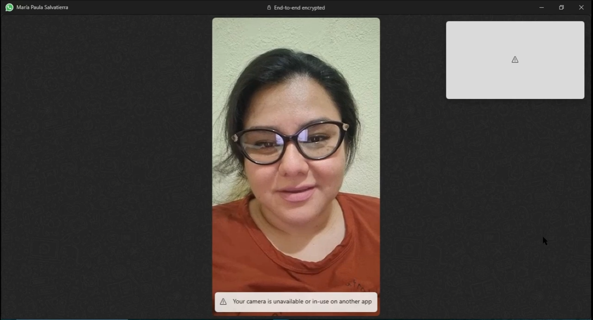|
|Enlace |[entrevistaMaria](https://www.youtube.com/watch?v=CnqwxDtK9wU)|
|Duracion| 2 min : 45 seg |
|Descripcion|María Paula es una emprendedora de comida rápida del distrito de Miraflores, Perú. Nos cuenta que estaría dispuesta a registrarse en una página que le ayude a promocionarse y a hacerse más visible, así como que estaría dispuesta a pagar una suscripción dependiendo de qué tan bueno sea el servicio de publicidad. Empezó hace un año con su negocio y dice ser conocida a nivel distrital, pero que le gustaría ser más conocida y llegar a más público. Destaca sus ofertas, su servicio, la sazón, su limpieza y la decoración de su local y recalca que es importante que la página disponga de usabilidad, que sea sencilla de usar.|

 

|Emprendedor|           |
|-----------|-----------|
|Nombres y Apellidos|Nelida Socorro Ruiz Agurto|
|Edad |         70      |
|Distrito|     Callao   |
|Captura ||
|Enlace |[entrevistaNelida](https://upcedupe-my.sharepoint.com/personal/u202114309_upc_edu_pe/_layouts/15/stream.aspx?id=%2Fpersonal%2Fu202114309%5Fupc%5Fedu%5Fpe%2FDocuments%2FWIN%5F20230825%5F23%5F24%5F28%5FPro%2Emp4&nav=eyJyZWZlcnJhbEluZm8iOnsicmVmZXJyYWxBcHAiOiJTdHJlYW1XZWJBcHAiLCJyZWZlcnJhbFZpZXciOiJTaGFyZURpYWxvZyIsInJlZmVycmFsQXBwUGxhdGZvcm0iOiJXZWIiLCJyZWZlcnJhbE1vZGUiOiJ2aWV3In19&nav=eyJyZWZlcnJhbEluZm8iOnsicmVmZXJyYWxBcHAiOiJTdHJlYW1XZWJBcHAiLCJyZWZlcnJhbFZpZXciOiJTaGFyZURpYWxvZyIsInJlZmVycmFsQXBwUGxhdGZvcm0iOiJXZWIiLCJyZWZlcnJhbE1vZGUiOiJ2aWV3In19&ga=1)|
|Duracion| 4 min : 4 seg |
|Descripcion|Nelida es una emprendedora de postres caseros en el distrito del Callao, con una experiencia de 30 años vendiendo donas y cocadas, donde sus mayores compradores siempre son los vecinos que saben de su emprendimiento. Ella nos cuenta que alcanzar un público fijo es cuestión de un proceso lento que suele desanimar un poco al emprendedor, además de asegurarse que los primeros clientes los recomienden a sus conocidos.|

 

|Consumidor|            |
|-----------|-----------|
|Nombres y Apellidos|Gabriela Yupanqui|
|Edad |        19       |
|Distrito| Carabayllo   |
|Captura |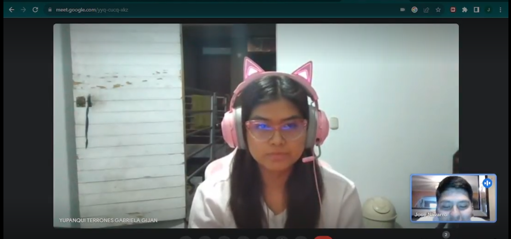|
|Enlace |[entrevistaGabriela](https://upcedupe-my.sharepoint.com/personal/u20201f316_upc_edu_pe/_layouts/15/stream.aspx?id=%2Fpersonal%2Fu20201f316%5Fupc%5Fedu%5Fpe%2FDocuments%2F2023%2D08%2D26%2018%2D15%2D43%2Emkv&ga=1)|
|Duracion|  3 min : 39 seg    |
|Descripcion|Gabriela es una joven que suele comprar comida por delivery. Ella suele comprar todas las semanas, sobre todo los viernes, sábados y domingos. Gabriela nos comenta que conoce varias plataformas de comida, pero no todas satisficieron sus necesidades, ya que tuvo algunos imprevistos con algunas de ellas. Ella es una consumidora muy frecuente, ya que le ahorra mucho tiempo y así se puede dedicar a su vida cotidiana, cómo estudiar y las tareas del hogar. Por último nos comento que si le gustaria usar una plataforma que ayude a los nuevos emprendedores, pero también aclaró que su apoyo sería constante si sus productos son buenos.|

 

|Consumidor|            |
|-----------|-----------|
|Nombres y Apellidos|Katherine Bautista|
|Edad |       23        |
|Distrito| Miraflores   |
|Captura ||
|Enlace |[entrevistaKatherine](https://upcedupe-my.sharepoint.com/personal/u20201b895_upc_edu_pe/_layouts/15/stream.aspx?id=%2Fpersonal%2Fu20201b895%5Fupc%5Fedu%5Fpe%2FDocuments%2F1%2Ewebm&nav=eyJyZWZlcnJhbEluZm8iOnsicmVmZXJyYWxBcHAiOiJTdHJlYW1XZWJBcHAiLCJyZWZlcnJhbFZpZXciOiJTaGFyZURpYWxvZyIsInJlZmVycmFsQXBwUGxhdGZvcm0iOiJXZWIiLCJyZWZlcnJhbE1vZGUiOiJ2aWV3In19&nav=eyJyZWZlcnJhbEluZm8iOnsicmVmZXJyYWxBcHAiOiJTdHJlYW1XZWJBcHAiLCJyZWZlcnJhbFZpZXciOiJTaGFyZURpYWxvZyIsInJlZmVycmFsQXBwUGxhdGZvcm0iOiJXZWIiLCJyZWZlcnJhbE1vZGUiOiJ2aWV3In19&ga=1)|
|Duracion|   4 min : 09 seg   |
|Descripcion|Katherine es una chica que estudia arquitectura, tiene 23 años y compra regularmente comidas por deliverys, especialmente los fines de semana. Katherine dice conocer poco o casi nada de las tiendas de comidas o restaurantes de su localidad, ella dice que siempre pide a las mismas tiendas conocidas como pizza hut, MacDonald, kfc entre otros. En última instancia ella nos comenta que a veces no le gusta el trato que le dan otras empresas al ella pedir su comida por ende, últimamente está dejando de pedir comida, pero ella dice que si la trataran mejor en estos lugares donde ella pide comida, ella pediría mucho más de lo que pide hoy en dia.|

 

|Consumidor|            |
|-----------|-----------|
|Nombres y Apellidos|Sara Solange Isla|
|Edad |        43       |
|Distrito|    Callao    |
|Captura |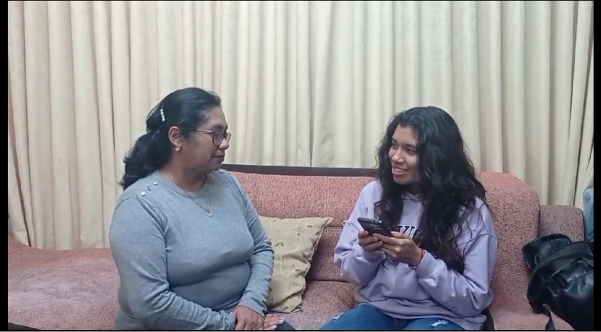|
|Enlace |[entrevistaSara](https://upcedupe-my.sharepoint.com/personal/u202114309_upc_edu_pe/_layouts/15/stream.aspx?id=%2Fpersonal%2Fu202114309%5Fupc%5Fedu%5Fpe%2FDocuments%2FV%C3%ADdeo%20sin%20t%C3%ADtulo%20%E2%80%90%20Hecho%20con%20Clipchamp%20%286%29%2Emp4&nav=eyJyZWZlcnJhbEluZm8iOnsicmVmZXJyYWxBcHAiOiJTdHJlYW1XZWJBcHAiLCJyZWZlcnJhbFZpZXciOiJTaGFyZURpYWxvZyIsInJlZmVycmFsQXBwUGxhdGZvcm0iOiJXZWIiLCJyZWZlcnJhbE1vZGUiOiJ2aWV3In19&nav=eyJyZWZlcnJhbEluZm8iOnsicmVmZXJyYWxBcHAiOiJTdHJlYW1XZWJBcHAiLCJyZWZlcnJhbFZpZXciOiJTaGFyZURpYWxvZyIsInJlZmVycmFsQXBwUGxhdGZvcm0iOiJXZWIiLCJyZWZlcnJhbE1vZGUiOiJ2aWV3In19&ga=1)|
|Duracion|2 min : 12 seg|
|Descripcion|Sara es una persona de 43 años que vive en el distrito del Callao. De vez en cuando, suele comprar comida rápida ya sea en delivery o yendo a un centro de comida. Ella comenta que por la zona donde vive es un poco complicado ya que no llegan los motorizados y los puestos de comida que está alrededor no tienen mucha publicidad. También comenta que las promociones llamarían la atención de muchas personas y que las opciones que brinda la aplicación tiene una buena funcionalidad.|

 

### 2.2.3. Analisis de Entrevistas

### Analisis Emprendedor:

Las entrevistas con los emprendedores, Nelida, María Paula y Junior Córdoba, resaltan ciertos aspectos comunes. Todos ellos enfrentan el desafío de ganar visibilidad y llegar a un público más amplio en sus respectivos negocios de postres caseros, comida rápida y pizza. Expresan su disposición a utilizar una plataforma como EmprendeChef para promocionarse y hacerse más visibles. María Paula está dispuesta a pagar por una suscripción si el servicio publicitario es efectivo, y Junior Córdoba también consideraría una suscripción mensual para destacar en una plataforma que describa adecuadamente su negocio. Estos emprendedores buscan visibilidad y reconocen la importancia de la usabilidad y la facilidad de uso de la plataforma. EmprendeChef podría ayudar a estos emprendedores a superar los desafíos de visibilidad, ofreciendo una plataforma amigable y efectiva para promocionar sus productos y servicios, y conectándolos con un público más amplio.

### Analisis Consumidor: 

Las tres entrevistas revelan un patrón común: la demanda constante de comida por delivery, especialmente los fines de semana, pero con problemas en experiencias pasadas. Los entrevistados, Gabriela y Katherine, están dispuestos a apoyar a emprendedores locales si reciben un mejor trato, mientras que Sara valora las promociones y la variedad de opciones. Aquí es donde EmprendeChef puede intervenir: como una plataforma que destaca a emprendedores locales y ofrece una experiencia de cliente excepcional, proporcionando una amplia gama de opciones y promociones para atraer a consumidores. Conectar a consumidores con emprendedores locales y mejorar la experiencia del cliente podría ser la clave para el éxito de EmprendeChef en este mercado.

 

# 2.3. Needfinding

### 2.3.1. User Personas

#### Emprendedor:

  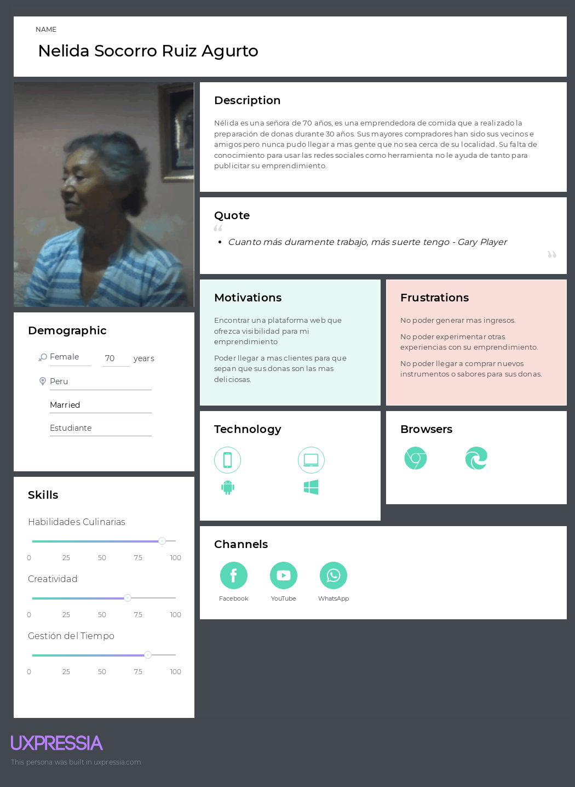

#### Consumidor:

  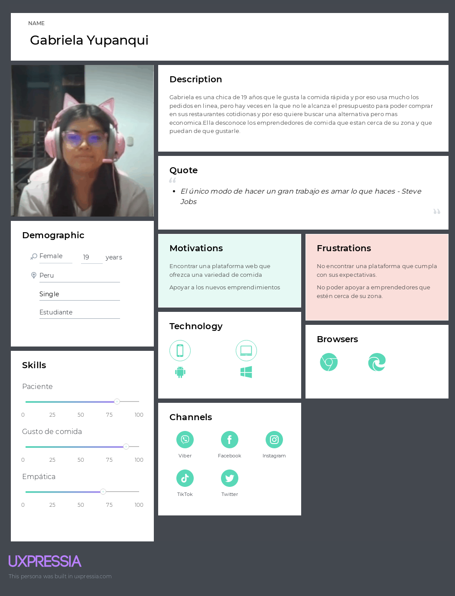

### 2.3.2. User Task Matrix

|Tareas|Frecuencia|Importancia|
|------|----------|-----------|
|Buscar información de los emprendedores inscritos en la plataforma|Often|High|
|Iniciar sesión|Often|High|
|Visualizar el inicio de la página|Sometimes|Medium|
|Verificar la ubicación de las tiendas|Often|High|
|Visualizar métodos de pagos|Often|High|
|Visualizar promociones|Often|Medium|

### 2.3.3. User Journey Mapping

#### Emprendedor:

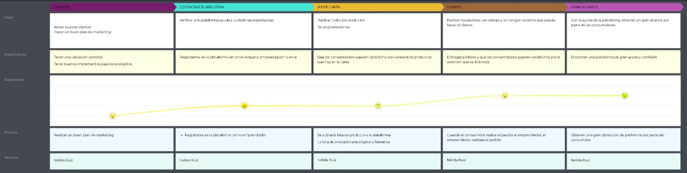

#### Consumidor:

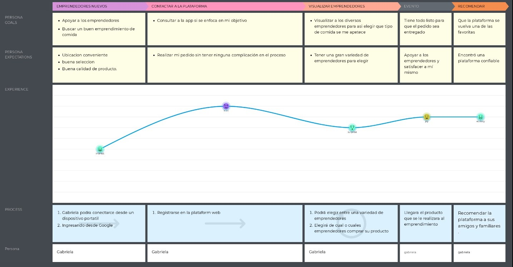

### 2.3.4. Empathy Mapping

#### Emprendedor:

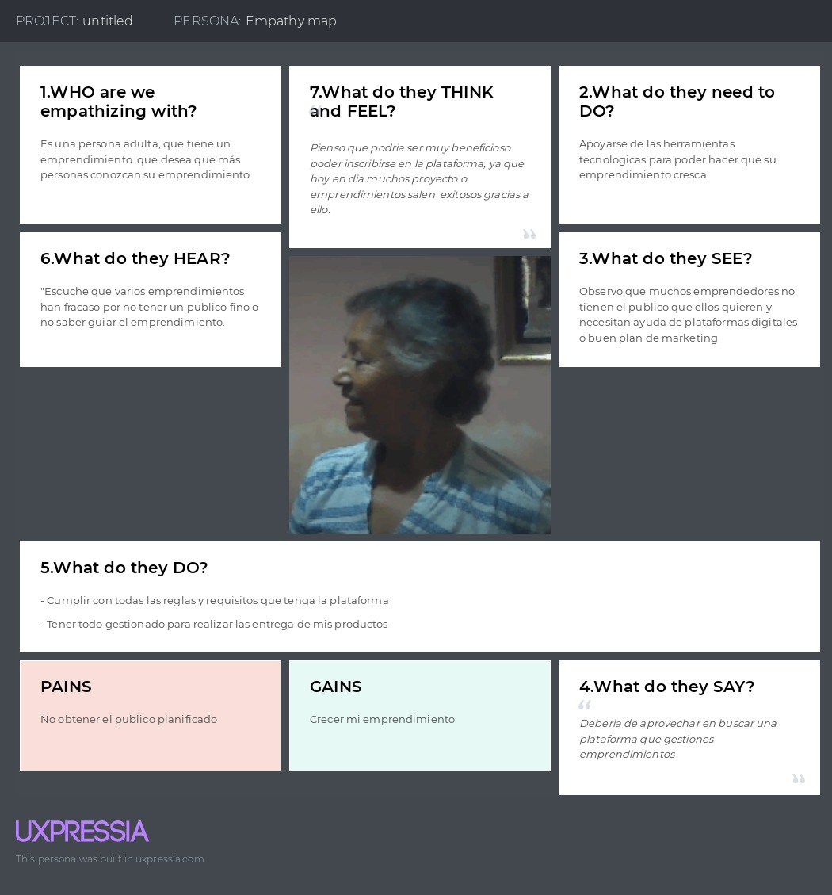

#### Consumidor:

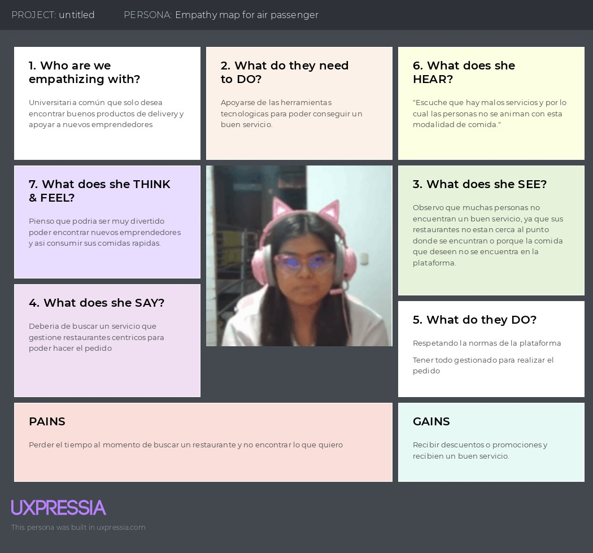

### 2.3.5. As-is Scenario Mapping

#### As-is Scenario Mapping - Emprendedor:

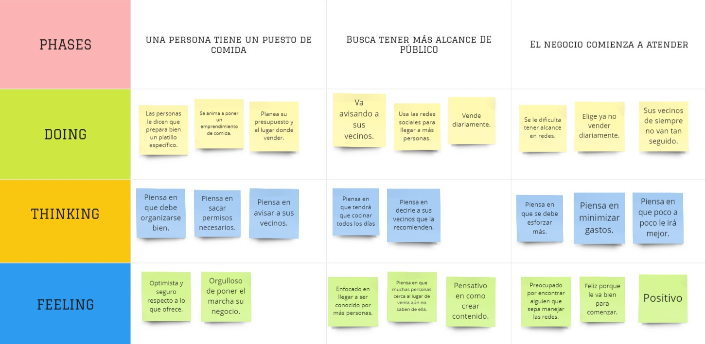

#### As-is Scenario Mapping - Consumidor:

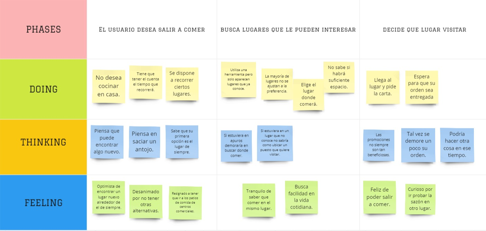

