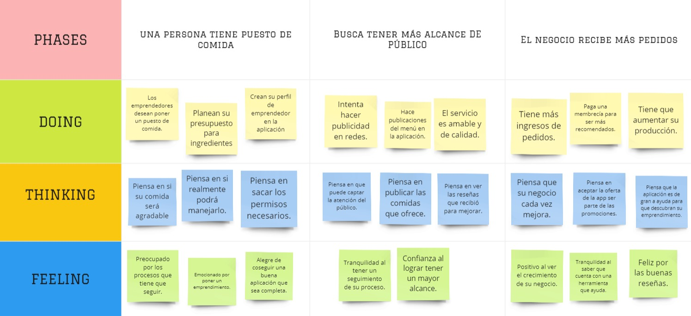
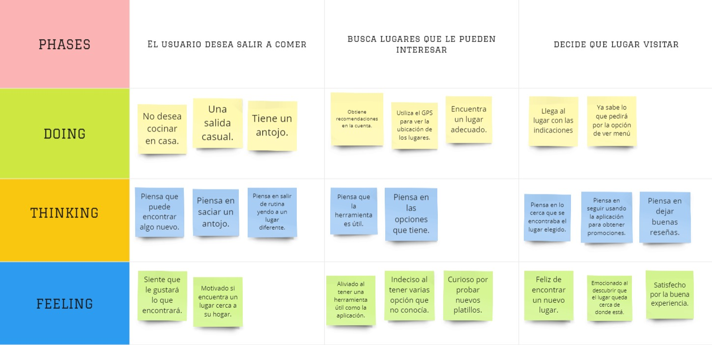

## Requirements Specification:

 

# 3.1. To-Be Scenario Mapping

#### To-Be Scenario Mapping para Emprendedores

#### To-Be Scenario Mapping para Consumidores

 

# 3.2. User Stories

|User Story|US01|
|----------|----|
|Epic ID   |EP01|
|Title|Busqueda de productos por palabra clave|
|Description|**Como** usuario **quiero** poder buscar productos por palabra clave **para** encontrar productos específicos.|
|Acceptance Criteria|**Escenario 01: Búsqueda de productos:** Dado que el usuario quiere ingresar una palabra clave en el campo de búsqueda Y hace clic en buscar Cuando la app muestra los resultados correspondientes a esa palabra clave. Entonces se deben ordenar por relevancia.
| 

|User Story |US02 |
|-----|----|
|Epic ID |EP02 |
|Title |Filtrado de resultados por precios.|
|Description |**Como** usuario **quiero** poder filtrar los resultados de búsqueda por precio **para** encontrar productos que se ajusten a mi presupuesto.|
|Acceptance Criteria |**Escenario 01: Filtrado por precios:** Dado que después de realizar una búsqueda apropiada a la necesidad del usuario. Y este hace clic en el buscador, cuando la app muestra la selección de un rango de precios para filtrar los resultados entonces se mostrará en el rango estimado.
|

|User Story |US03 |
|-----|----|
|Epic ID |EP03|
|Title |Guardar productos en lista de deseos.|
|Description |**Como** usuario **quiero** poder guardar productos en una lista de deseos **para** volver a ellos más tarde.|
|Acceptance Criteria |**Escenario 01: Agregar a lista de deseos:** Dado que el usuario agrega un producto a su lista de deseos Y selecciona en “Lista de deseos” Cuando el producto pedido se guarda automáticamente Entonces se mostrará el resultado guardado en la lista de deseos.|
||**Escenario 02: Eliminar de la lista de deseos:** Dado que el usuario quiere eliminar el producto después de su búsqueda Y selecciona la opción “Eliminar elemento” Cuando el producto guardado se elimina instantáneamente de su lista de deseos Entonces se mostrará el producto solo en la sección de búsqueda.
|

|User Story |US04|
|-----|----|
|Epic ID |EP04|
|Title |Ordenamiento de resultados por popularidad.|
|Description |**Como** usuario **quiero** poder ordenar los resultados de búsqueda por popularidad **para** ver los productos más populares primero.|
|Acceptance Criteria |**Escenario 01: Ordenar por popularidad:** Dado que el usuario quiere mostrar los resultados obtenidos, se le mostrará la opción “Por popularidad o por configuración”, Y el usuario deberá seleccionar una de las dos opciones Cuando después de seleccionar, el sistema se configurará automáticamente Entonces cada vez que muestre los resultados, también se agregaron las ofertas o descuentos del producto por su popularidad.
|

|User Story |US05 |
|-----|----|
|Epic ID |EP05 |
|Title |Comparación de precios.|
|Description |**Como** usuario **quiero** poder comparar precios de un mismo producto en diferentes tiendas **para** encontrar la mejor opción de compra.|
|Acceptance Criteria | **Escenario 01: Comparación de precios:** Dado que estoy en la pantalla de resultados de búsqueda Y hago clic en buscar Cuando haga clic en comparación de precios. Entonces se mostrará una lista de precios de cada tienda que venda el producto Y podré hacer clic en el producto para ver más detalles del producto y la tienda.
|

|User Story |US06 |
|-----|----|
|Epic ID |EP06 |
|Title |Notificaciones de precios|
|Description |**Como** usuario **quiero** recibir notificaciones **para** que los productos que estoy buscando estén disponibles o en oferta.|
|Acceptance Criteria |**Escenario 01: Configuración de Notificaciones:** Dado que estoy en la pantalla de detalles de un producto Cuando haga clic en el botón de configuración de notificaciones, entonces la app me permitirá seleccionar el tipo de notificación que quiero recibir (Disponibilidad u oferta) Y puedo elegir cómo quiero recibir la notificación (notificación de la app)
|

|User Story |US07 |
|-----|----|
|Epic ID |EP07|
|Title |Búsqueda de tiendas cercanas|
|Description |**Como** usuario **quiero** poder buscar tiendas cercanas a mi ubicación **para** poder encontrar fácilmente una tienda donde comprar el producto que necesito.|
|Acceptance Criteria | **Escenario 01: Búsqueda por ubicación:** Dado que estoy en la pantalla principal de la app Cuando selecciono la opción de búsqueda por ubicación. Entonces la app me muestra un mapa con mi ubicación actual y las tiendas cercanas Y puedo hacer clic en una tienda para ver más detalles.|
||**Escenario 02: Filtración de búsqueda por ubicación:** Dado que estoy en la pantalla de resultados de búsqueda por ubicación Cuando hago clic en el botón de filtro Entonces la app muestra opciones de filtrado para distancia, tipo de tienda y otras características Y la app actualiza los resultados para mostrar solo las tiendas que cumplen con los filtros seleccionados
|

|User Story |US08 |
|-----|----|
|Epic ID |EP08 |
|Title |Comentarios y reseñas de productos|
|Description |**Como** usuario **quiero** poder leer comentarios y reseñas de otros usuarios **para** saber sobre un producto y tomar una decisión sobre mis productos.|
|Acceptance Criteria |**Escenario 01: Ver comentarios y reseñas:** Dado que estoy en la pantalla de detalles de un producto Cuando hago clic en el botón de comentarios y reseñas Entonces la app me muestra una lista de todos los comentarios y reseñas sobre un producto Y podré ver el nombre de usuario, la calificación y el comentario de cada usuario.|
||**Escenario 02: Dejar comentarios y reseñas:** Dado que estoy en la pantalla de detalles de un producto Cuando hago clic en el botón de comentarios y reseñas Entonces la app me permite escribir un comentario o reseña sobre el producto Y la app publica mi comentario o reseña
|

|User Story |US09 |
|-----|----|
|Epic ID |EP09|
|Title |Opciones de pago|
|Description |**Como** usuario **quiero** ver las opciones de pago disponibles en cada tienda **para** poder elegir la más conveniente.|
|Acceptance Criteria |**Escenario 01: Ver opciones de pago:** Dado que estoy en la pantalla de detalles de una tienda Cuando hago clic en el botón de opciones de pago Entonces la app me muestra una lista de todas las opciones de pago disponibles en la tienda Y puedo hacer clic en la opción de pago para ver más detalles de pago
|

|User Story |US10 |
|-----|----|
|Epic ID |EP10|
|Title |Lista de compras|
|Description |**Como** usuario **quiero** poder crear listas de compras **para** organizar mis productos y encontrarlos más fácilmente|
|Acceptance Criteria |**Escenario 01: Crear una lista de compras:** Dado que estoy en la pantalla principal de la app Cuando hago clic en el botón de crear una lista de compras para el usuario Entonces la app me permite escribir un nombre para la lista de compra Y la app agrega la lista de compras a mi lista de compras Y puedo hacer clic en la lista de compras para ver los productos que he agregado.|
||**Escenario 02: Agregar productos a la lista de compra:** Dado que estoy en la pantalla de detalles de un producto Cuando hago clic en el botón de agregar a lista de compra Entonces la app agrega el producto seleccionado a mi lista de compras
|

|User Story|US11|
|----------|----|
|Epic ID | EP11 |
|Title |Historial de precios|
|Description|**Como** usuario **quiero** poder ver el historial de precios de un producto **para** decidir si espero a que baje de precio o lo compro ahora|
|Acceptance Criteria|**Escenario 01: Ver historial de precios:** Dado que estoy en la pantalla de detalles de un producto Cuando hago clic en el botón de historial de precios Entonces la app me muestra un gráfico con el historial de precios del producto en las tiendas disponibles Y puedo seleccionar un rango de tiempo para ver el historial de precios en ese periodo específico|
||**Escenario 02: Comprar con información de historial de precios:** Dado que estoy en la pantalla de detalles de un producto Cuando decido comprar el producto Entonces la app me muestra un mensaje de advertencia si el precio actual es significativamente más alto que el precio promedio en el historial de precios
|

|User Story|US12|
|----------|----|
|Epic ID | EP12 |
|Title |Ofertas destacadas|
|Description|**Como** usuario **quiero** poder ver las ofertas más destacadas de la semana **para** aprovechar los mejores precios|
|Acceptance Criteria|**Escenario 01: Ver ofertas destacadas:** Dado que estoy en la pantalla de la app cuando desplazo hacia abajo en la pantalla Entonces la app me muestra una sección de ofertas destacadas Y puedo ver los productos en oferta y la cantidad de descuento Y puedo hacer clic en un producto para ver los detalles y comprarlo
|

|User Story|US13|
|----------|----|
|Epic ID | EP13 |
|Title |Alertas de precios|
|Description|**Como** usuario **quiero** recibir alertas de precio **para** los productos que me interesan saber cuando bajan de precio|
|Acceptance Criteria|**Escenario 01: Configurar alertas de precio:** Dado que estoy en la pantalla de detalles de un producto Cuando hago clic en el botón de alerta de precio Entonces la app me permite configurar la alerta de precio para ese producto Y puedo elegir una cantidad específica de descuento o un precio objetivo para recibir la alerta.|
||**Escenario 02: Recibir alertas de precio:** Dado que he configurado una alerta de precio para un producto Cuando el precio del producto baja a la cantidad específica o al precio objetivo Entonces la app me envía una alerta por el método que elegí.
|

|User Story|US14|
|----------|----|
|Epic ID | EP14 |
|Title |Compartir productos|
|Description|**Como** usuario **quiero** poder compartir productos que encuentro en la app con amigos y familiares **para** obtener sus opiniones.|
|Acceptance Criteria|**Escenario 01: Compartir productos en redes sociales:** Dado que estoy en la pantalla de detalles de un producto Cuando hago clic en el botón de compartir Entonces la app me muestra opciones para compartir el producto en redes sociales como Facebook, Twitter e Instagram Y puedo elegir una red social y compartir el producto con un mensaje personalizado.|
||**Escenario 02: Compartir productos por correo electrónico:** Dado que estoy en la pantalla de detalles de un producto Cuando hago clic en el botón de compartir Entonces la app me permite compartir el producto por correo electrónico Y puedo escribir una dirección de correo electrónico y un mensaje para enviar el producto a alguien.
|

|User Story|US15|
|----------|----|
|Epic ID | EP15 |
|Title |Códigos de descuento|
|Description|**Como** usuario **quiero** poder encontrar y aplicar códigos de descuento **para** ahorrar dinero en mis compras|
|Acceptance Criteria|**Escenario 01: Ver códigos de descuento:** Dado que estoy en la pantalla de detalles de un producto Cuando desplazó hacia abajo la pantalla en la derecha Entonces veré la opción “Canjear código” Y al escribir el código solicitado y disponible, se aplicará el descuento correspondiente.
|

|User Story|US16|
|----------|----|
|Epic ID | EP16 |
|Title |Cambio de contraseñas|
|Description|**Como** usuario **quiero** que la aplicación me informe cada cierto tiempo a cambiar de contraseña **para** tener más seguridad.|
|Acceptance Criteria|**Escenario 01: Cambio frecuente de contraseña:** Dado que después de cierto tiempo, el sistema recomendará cambiar la contraseña Cuando esté usando la app normalmente Y haya pasado el tiempo designado Entonces se mostrará un anuncio recomendando cambiar la contraseña para mayor seguridad
|

|User Story|US17|
|----------|----|
|Epic ID | EP17 |
|Title |Búsqueda avanzada|
|Description|**Como** usuario **quiero** poder realizar una búsqueda avanzada con filtros **para** encontrar productos específicos de manera más fácil y rápida.|
|Acceptance Criteria|**Escenario 01: Acceder a la búsqueda avanzada:** Dado que estoy en la pantalla principal de búsqueda Cuando selecciono la opción de “Búsqueda avanzada” Entonces la app me muestra una pantalla con una serie de filtros, como marca, precio, tamaño, color, etc.|
||**Escenario 02: Aplicar filtros en la búsqueda avanzada:** Dado que estoy en la pantalla de búsqueda avanzada Cuando selecciono uno o más filtros y aplicó la búsqueda Entonces la app me muestra los productos que coinciden con los filtros seleccionados Y la app me permite deshacer los filtros aplicados si quiero ampliar la búsqueda.
|

|User Story|US18|
|----------|----|
|Epic ID | EP18 |
|Title |Búsqueda por voz|
|Description|**Como** usuario **quiero** poder buscar productos en la app utilizando comandos de voz **para** una experiencia más práctica y fácil.|
|Acceptance Criteria|**Escenario 01: Activar la búsqueda por voz:** Dado que estoy en la pantalla de búsqueda Cuando selecciono la opción de búsqueda por voz Entonces la app me permite activar la búsqueda por voz a través del micrófono de mi dispositivo móvil.|

|User Story|US19|
|----------|----|
|Epic ID | EP19 |
|Title |Compras en grupo|
|Description|**Como** usuario **quiero** poder crear y unirme a compras en grupo con amigos o familiares **para** obtener descuentos en productos.|
|Acceptance Criteria|**Escenario 01: Crear compra en grupo:** Dado que quiero realizar una compra en grupo con amigos o familiares Cuando selecciono la opción “Crear compra en grupo” Entonces la app me permite seleccionar el producto que quiero comprar y la cantidad que necesito.|
||**Escenario 02: Invitar amigos o familia a una compra en grupo:** Dado que he creado una compra en grupo Cuando selecciono la opción “Invitar amigos o familiares” Entonces la app me permite enviar un enlace de invitación por correo electrónico o mensaje de texto.
|

|User Story|US20|
|----------|----|
|Epic ID | EP20 |
|Title |Chat con la tienda|
|Description|**Como** usuario **quiero** poder comunicarme con la tienda sobre un producto **para**  poder hacer preguntas y aclarar mis dudas antes de realizar la compra.|
|Acceptance Criteria|**Escenario 01: Acceder al chat con la tienda:** Dado que estoy en la pantalla de detalles del producto Cuando selecciono la opción “Chat con la tienda seleccionada” Entonces la app me muestra una pantalla de chat donde puedo comunicarme con el vendedor del producto.
|

|User Story|US21|
|----------|----|
|Epic ID | EP21 |
|Title |Recomendaciones personalizadas|
|Description|**Como** usuario **quiero** recibir recomendaciones de productos **para** que estén basadas en mis preferencias y compras anteriores.|
|Acceptance Criteria|**Escenario 01: Recibir recomendaciones personalizadas:** Dado que estoy en la pantalla principal de la app Cuando la app analiza mis preferencias y compras anteriores Entonces la app me muestra una sección de recomendaciones personalizadas con productos que podrían interesarme.
|

|User Story|US22|
|----------|----|
|Epic ID | EP22 |
|Title |Seguimiento de envío|
|Description|**Como** usuario **quiero** poder rastrear el estado y la ubicación de mis pedidos **para** saber cuándo llegarán.|
|Acceptance Criteria|**Escenario 01: Seguimiento de envío:** Dado que he realizado un pedido y he recibido la confirmación de envío Cuando selecciono la opción “Seguimiento de envío” en la app Entonces la app me muestra el estado actual del envío y la ubicación en tiempo real del paquete.|

|User Story|US23|
|----------|----|
|Epic ID | EP23 |
|Title | Devoluciones y reembolsos|
|Description|**Como** usuario **quiero** poder solicitar devoluciones y reembolsos **para** productos defectuosos o que no cumplan con mis expectativas.|
|Acceptance Criteria|**Escenario 01: Iniciar solicitud de devolución o reembolso:** Dado que he recibido un producto defectuoso o que no cumple con mis expectativas Cuando selecciono la opción “Solicitar devolución o reembolso” en la app Entonces la app me guía a través de los pasos para iniciar el proceso de devolución o reembolso.|
||**Escenario 02: Seguimiento de la solicitud de devolución o reembolso:** Dado que he iniciado una solicitud de devolución o reembolso Cuando selecciono la opción “Seguimiento de solicitud” en la app Entonces la app me muestra el estado actual de mi solicitud y cualquier actualización relacionada.
|

|User Story|US24|
|----------|----|
|Epic ID | EP24 |
|Title |Soporte al cliente|
|Description|**Como** usuario **quiero** tener acceso a soporte al cliente **para** resolver problemas y obtener ayuda con mis compras.|
|Acceptance Criteria|**Escenario 01: Acceder al soporte al cliente:** Dado que tengo un problema o pregunta relacionada con mi compra Cuando selecciono la opción “Soporte al cliente” en la app Entonces la app me proporciona información de contacto y opciones para comunicarse con el equipo de soporte.
|

|User Story|US25|
|----------|----|
|Epic ID | EP25 |
|Title |Cambio de idioma|
|Description|**Como** usuario **quiero** poder cambiar el idioma de la app **para** tener una experiencia en mi idioma preferido.|
|Acceptance Criteria|**Escenario 01: Cambiar el idioma de la app:** Dado que quiero cambiar el idioma de la app a mi idioma preferido Cuando selecciono la opción “Cambiar idioma” en la app Entonces la app me muestra una lista de idiomas disponibles y cambia el idioma de la interfaz de usuario.
|

 

# 3.3. Impact Mapping

Business Goals:

* Aumentar el número de usuarios suscritos al plan A en un 50% en los próximos 6 meses.
* Alcanzar una tasa de conversión del 30% de usuarios que visitan la app a usuarios que realizan compras en un año.
* Lograr una calificación promedio de 4.5 estrellas en las reseñas de productos dentro de los primeros 3 meses.

|Business Goal|Actors/Personas|Impact|Deliverables|User Stories|
|----|---|---|--|--|
|1. Aumentar suscripciones al plan A|Usuario1,Usuario2|Se suscriben al plan A para acceder a ofertas exclusivas.|Ofrecer descuentos especiales y promociones para usuarios suscritos.|US01, US10|
|2. Alcanzar tasa de conversión del 30%|Usuario1,Usuario2|Realizan compras después de ver recomendaciones personalizadas y reseñas.|Implementar algoritmo de recomendaciones y mostrar reseñas de productos.|US21, US08|
|3. Obtener calificación promedio de 4.5 estrellas|Usuario1, Usuario2|Dejan reseñas positivas y mejoran sus productos.|Solicitar reseñas después de la compra y proporcionar un proceso fácil para que los emprendedores actualicen productos.|US08, US12, US2|

 

# 3.4. Product Backlog

| #Orden | User Story Id | Description | Story Points (1/2/5/8)|
|--------|-------|-----|-----|
|1|US21|Recomendaciones personalizadas: Como usuario quiero recibir recomendaciones de productos basadas en mis preferencias y compras anteriores.|8|
|2|US22|Seguimiento de envío: Como usuario quiero poder rastrear el estado y la ubicación de mis pedidos para saber cuándo llegarán.|8|
|3|US23|Devoluciones y reembolsos: Como usuario quiero poder solicitar devoluciones y reembolsos para productos defectuosos o que no cumplan con mis expectativas.|8|
|4|US24|Soporte al cliente: Como usuario quiero tener acceso a soporte al cliente para resolver problemas y obtener ayuda con mis compras.|8|
|5|US25|Cambio de idioma: Como usuario quiero poder cambiar el idioma de la app para tener una experiencia en mi idioma preferido.|8|
|6|US08|Comentarios y reseñas de productos: Como usuario quiero poder leer comentarios y reseñas de otros usuarios sobre un producto para tomar una decisión de compra informada.|8|
|7|US15|Códigos de descuento: Como usuario quiero poder encontrar y aplicar códigos de descuento para ahorrar dinero en mis compras.|5|
|8|US16|Cambio de contraseñas: Como usuario quiero que la aplicación me informe cada cierto tiempo a cambiar de contraseña para tener más seguridad.|5|
|9|US17|Búsqueda por voz: Como usuario quiero poder buscar productos en la app utilizando comandos de voz para una experiencia más práctica y fácil.|5|
|10|US18|Compras en grupo: Como usuario quiero poder crear y unirse a compras en grupo con amigos o familiares para obtener descuentos en productos.|5|
|11|US19|Chat con la tienda: Como usuario quiero poder comunicarme con la tienda sobre un producto para hacer preguntas y aclarar mis dudas antes de realizar la compra.|5|
|12|US20|Compartir productos: Como usuario quiero poder compartir productos que encuentro en la app con amigos y familiares para obtener sus opiniones.|5|
|13|US02|Filtrado de resultados por precios: Como usuario quiero poder filtrar los resultados de búsqueda por precio para encontrar productos que se ajusten a mi presupuesto.|3|
|14|US09|Opciones de pago: Como usuario quiero ver las opciones de pago disponibles en cada tienda para poder elegir la más conveniente.|3|
|15|US10|Lista de compras: Como usuario quiero poder crear listas de compras para organizar mis productos y encontrarlos más fácilmente.|3|
|16|US11|Historial de precios: Como usuario quiero poder ver el historial de precios de un producto para decidir si espero a que baje de precio o lo compro ahora.|3|
|17|US12|Ofertas destacadas: Como usuario quiero poder ver las ofertas más destacadas de la semana para aprovechar los mejores precios.|3|
|18|US13|Alertas de precios: Como usuario quiero recibir alertas de precio para los productos que me interesan saber cuando bajan de precio.|3|
|19|US04|Ordenamiento de resultados por popularidad: Como usuario quiero poder ordenar los resultados de búsqueda por popularidad para ver los productos más populares primeros.|3|
|20|US06|Notificaciones de precios: Como usuario quiero recibir notificaciones cuando los productos que estoy buscando estén disponibles o en oferta.|3|
|21|US03|Guardar productos en lista de deseos: Como usuario quiero poder guardar productos en una lista de deseos para volver a ellos más tarde.|2|
|22|US14|Búsqueda de productos de palabra clave: Como usuario quiero poder buscar productos por palabra clave para encontrar productos específicos.|2|
|23|US05|Comparación de precios: Como usuario quiero poder comparar precios de un mismo producto en diferentes tiendas para encontrar la mejor opción de compra.|2|
|24|US07|Búsqueda de tiendas cercanas: Como usuario quiero poder buscar tiendas cercanas a mi ubicación para poder encontrar fácilmente una tienda donde comprar el producto que necesito.|2|
|25|US01|Filtrado de resultados por precios: Como usuario quiero poder filtrar los resultados de búsqueda por precio para encontrar productos que se ajusten a mi presupuesto|1|
