# 4.1. Style Guidelines

### 4.1.1. General Style Guidelines

**Lenguaje:** El lenguaje que se utilizará para la interfaz será formal, respetuoso, entusiasta y simple para que el usuario pueda tener una interpretación y entendimiento claro de las secciones o botones que incluiremos.

**Marca:** Para el logo de nuestra aplicación tuvimos una idea que resaltó entre las demás. También tuvimos que elegir un color estratégico que llame la atención y le incluimos el nombre.

<br>

<p align="center">

</p>

<br>

**Color:** Para esta sección tuvimos en consideración colores que ayuden a una lectura cómoda de la información y al buen contraste de las imágenes que utilizamos. También buscamos dar un aspecto formal sin dejar la estética de lado. Los colores primarios son los que más predominan en la estructura y los secundarios son más visibles en el texto y fondo.

<br>

<p align="center">
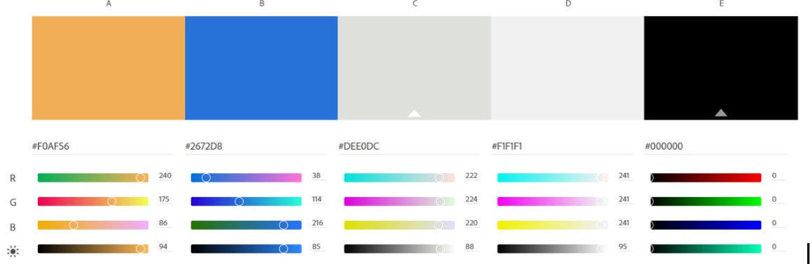
</p>

<br>

**Tipografia:** Para el estilo de texto utilizaremos las fuentes de Inter y Robot. Ambas para mantener una lectura cómoda, mantener la creatividad y diversidad estética además de poder resaltar los textos que sean necesarios.

<br>

<p align="center">
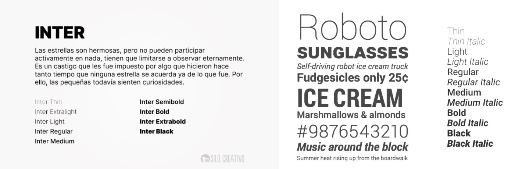
</p>

<br>

### 4.1.2. Web Style Guidelines

**Tipografia:** Para el estilo de los textos en nuestra página web es Inter, representando orden, formalidad y confianza. 

<br>

<p align="center">
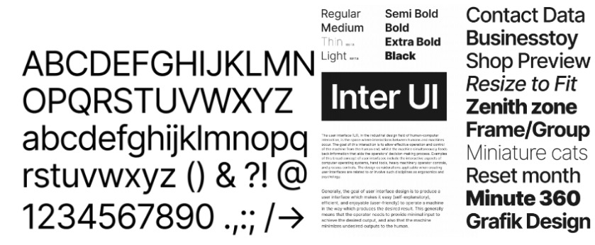
</p>

<br>

[Enlace de tipografia](https://rsms.me/inter/)

**Imagenes:** Con respecto a las imágenes, hemos decidido implementar fotografías referentes al ámbito de comida, los locales del los emprendimientos de comida y los platillos que cada uno ofrece.   
A continuación, se muestran algunas fotografías utilizadas en nuestra aplicación:

<br>

<p align="center">

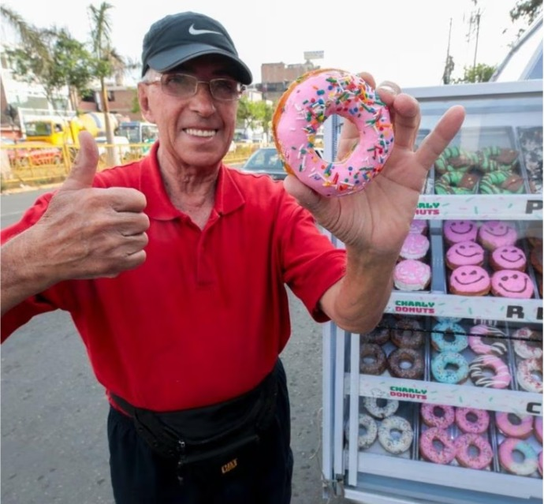

</p>

<br>

# 4.2. Information Architecture

En “EmprendeChef” la arquitectura de información que vamos a usar permitirá al usuario interactuar de manera sencilla y efectiva con el aplicativo. En el menú desplegable se mostrarán los botones que mostrarán información de relevancia ya sea sobre planes de suscripción, beneficios, contacto y en especial la opción de registro.

<p align="center">
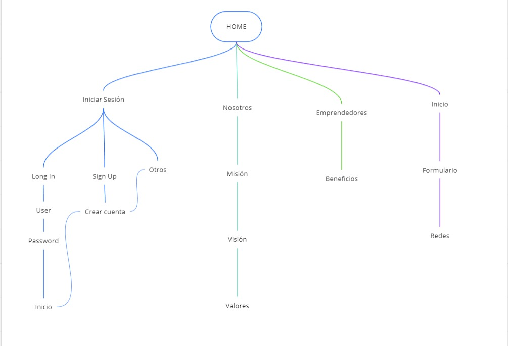
</p>

<br>

### 4.2.1. Organization Systems

Los “Organization System” en UX se refiere a la forma en la que está estructurada, etiquetada y distribuída la información y elementos de una página web.
En el landing page, la interfaz está organizada por cuadrículas de forma que la información se apreciará de forma ordenada. De esa forma el usuario podrá ver la información y sus opciones para interactuar con la página, además los botones están ubicados de forma estratégica tanto para crearse una cuenta como para subscribirse. 
La organización de contenido de forma jerárquica se aplicará al apartado de Nosotros y Suscripción. Por último el esquema de categorización de contenido será organizado por cada tópico.

<br>

### 4.2.2. Labelling Systems

Para el Labeling System se han colocado cinco etiquetas en la parte superior los cuales permitirán navegar de forma ordenada por cada sección. También cuenta con un menú desplegable en la parte superior.
Nosotros es un etiqueta que lleva hasta un apartado donde se explica sobre el startup.
Servicio es una etiqueta donde se describe cómo funciona la aplicación.
Registrarse es una etiqueta que incentiva a crearse una cuenta.
Suscripciones es un apartado que explica los beneficios que consigue cada tipo de usuario por una cuenta de pago.
Contáctanos contiene un formulario para ponerse en contacto con atención al cliente.

<p align="center">
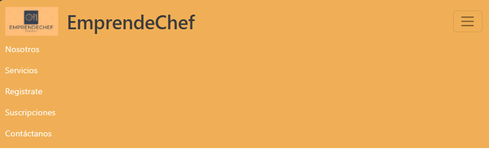
</p>

<br>

### 4.2.3. SEO Tags and Meta Tags

**Landing Page:**

```
 <nav class="navbar navbar-expand-lg">
      <div class="container-fluid">
        <a class="navbar-brand" href="#">
          
          <h1>EmprendeChef</h1>
        </a>
        <!-- for hyperlinks -->
        <button
          class="navbar-toggler"
          type="button"
          data-bs-toggle="collapse"
          data-bs-target="#navbarNav"
          aria-controls="navbarNav"
          aria-expanded="false"
          aria-label="Toggle navigation"
        >
          <span class="navbar-toggler-icon"></span>
        </button>
        <div class="collapse navbar-collapse" id="navbarNav">
          <ul class="navbar-nav">
            <li class="nav-item">
              <a class="nav-link" aria-current="page" href="#us-section">Nosotros</a>
            </li>
            <li class="nav-item">
              <a class="nav-link" href="#services-section">Servicios</a>
            </li>
            <li class="nav-item">
              <a class="nav-link" href="#register-section">Registrate</a>
            </li>
            <li class="nav-item">
              <a class="nav-link" href="#subscriptions-section">Suscripciones</a>
            </li>
            <li class="nav-item">
              <a class="nav-link" href="#contact_us-section">Contáctanos</a>
            </li>
          </ul>
        </div>
      </div>
    </nav>
```
<br>

### 4.2.4. Searching Systems

El sistema de búsqueda que se utilizará en la aplicación será por medio de la ubicación actual de donde se podrá recomendar lugares cercanos o también se podrá ver recomendación de lugares que estén un poco más alejados pero accesibles ya que de todas formas habrá la opción para ver el camino por recorrer desde el lugar donde se encuentra. Se podrá aplicar un filtro según el tipo de comida que se busca.
Según la búsqueda que se haga se podrá ir revisando las reseñas que se hayan publicado sobre cada emprendimiento además de también poder ver lo que ofrece cada uno.

### 4.2.5. Navigation Systems

Consideramos que el sistemas de Navegación de la aplicación está bien organizado de forma que sea amigable con el usuario. 
En el caso de los usuarios que son clientes o consumidores iniciarán la aplicación compartiendo su ubicación o escribiendo su lugar de destino donde se mostrarán los lugares más cercanos en orden de cercanía.
En el caso de los emprendedores se podrán actualizar un menú electrónico y los precios diariamente según el stock que pueda haber, también pueden recibir pedidos desde la aplicación. 

<br>

# 4.3. Landing Page UI Design

### 4.3.1. Landing Page Wireframe

[Enlace Figma Landing Page Wireframe - Web](https://www.figma.com/file/CE82SFMt5uBiSykl9VIL43/Styles-%26-UI-(Copy)?type=design&node-id=44183-2263&mode=design&t=Q46sIBGInTqPxx8G-0)

<p align="center">
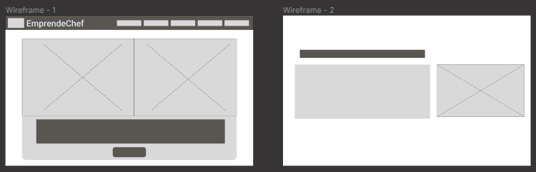
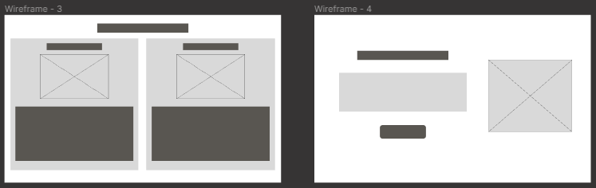
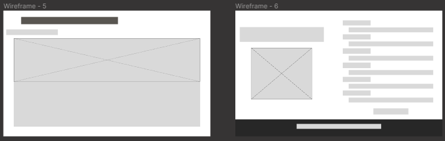
</p>

### 4.3.1. Landing Page Mock-up

[Enlace Figma Landing Page Mock-up Web](https://www.figma.com/file/CE82SFMt5uBiSykl9VIL43/Styles-%26-UI-(Copy)?type=design&node-id=44183-2263&mode=design&t=Q46sIBGInTqPxx8G-0)

<p align="center">
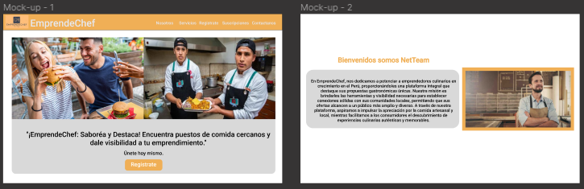
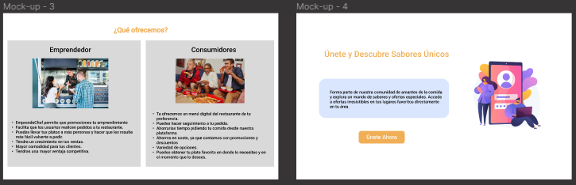
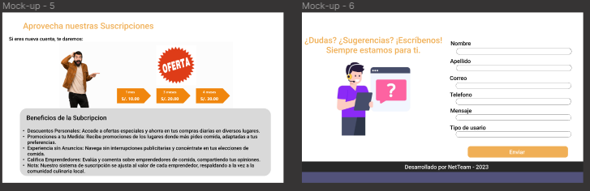
</p>

<br>

# 4.4. Web Applications UX/UI Design

### 4.4.1. Web Applications Wireframes

<p align="center">


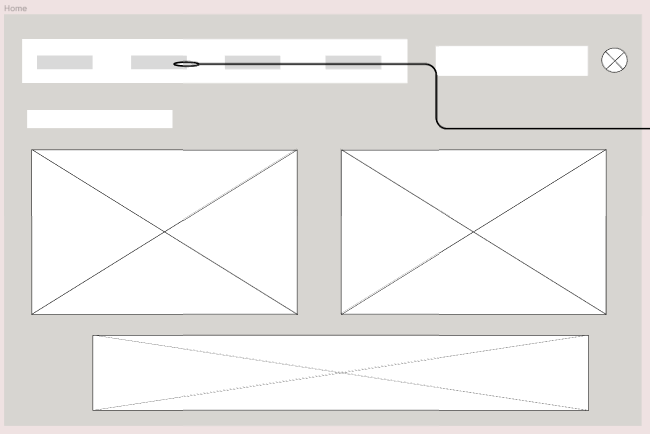
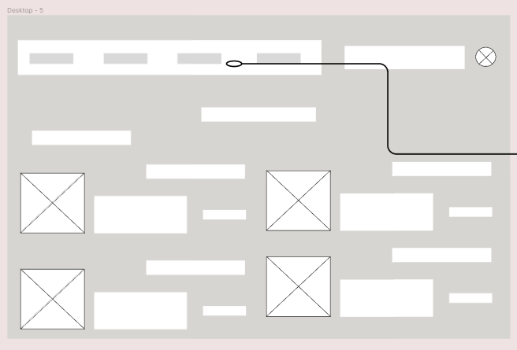
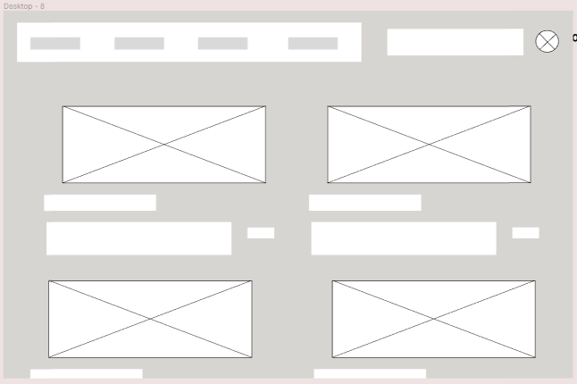
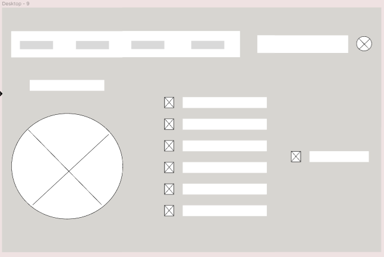
</p>

<br>

### 4.4.2. Web Applications Wireframes Diagrams

<p align="center">
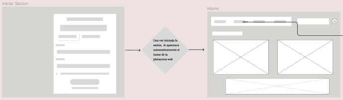
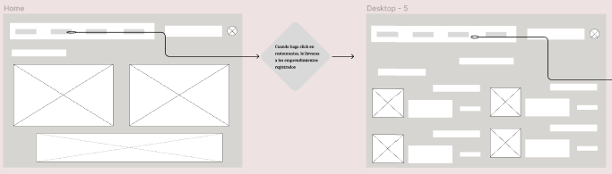
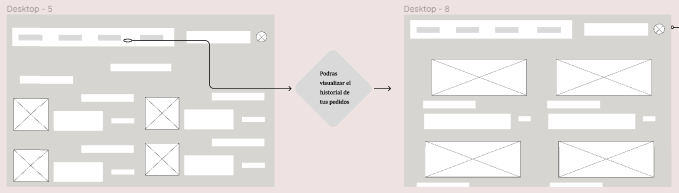
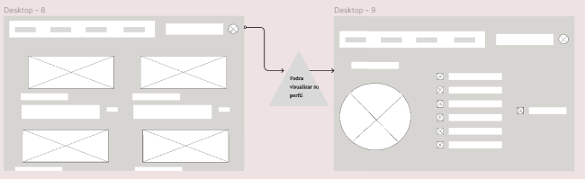
</p>

<br>

### 4.4.3. Web Applications Mock-ups

<p align="center">
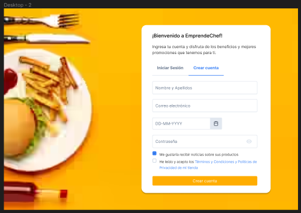
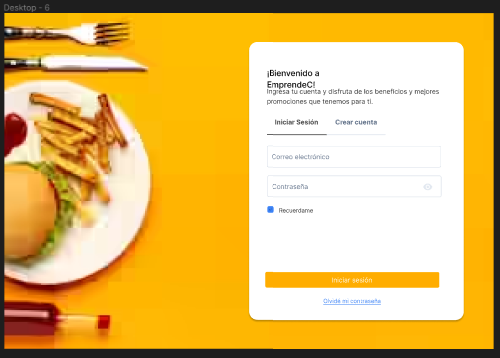
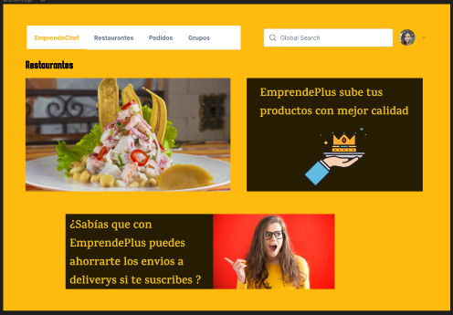
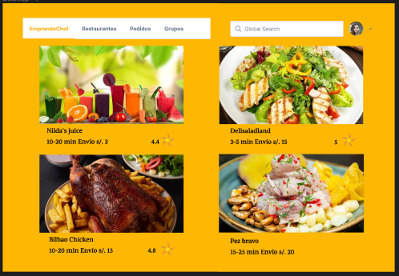
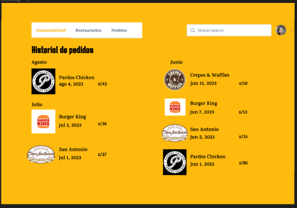
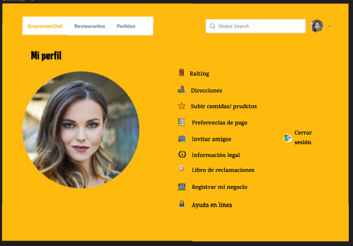
</p>

<br>

### 4.4.4. Web Applications User Flow Diagrams

<br>

# 4.5. Web Applications Prototyping

<p align="center">

</p>

> [Plantilla Prototy](https://www.figma.com/file/CE82SFMt5uBiSykl9VIL43/Styles-%26-UI-(Copy)?type=design&node-id=44183-2263&mode=design&t=037I1kASd4mVUYHV-0)

> [Enlace Prototy](https://www.figma.com/proto/CE82SFMt5uBiSykl9VIL43/Styles-%26-UI-(Copy)?type=design&node-id=45430-2&t=Ka0xYl9xB4yeq4hs-0&scaling=scale-down&page-id=44183%3A2263&starting-point-node-id=45430%3A2)

> [Enlace Video Prototy](https://upcedupe-my.sharepoint.com/personal/u20201b895_upc_edu_pe/_layouts/15/stream.aspx?id=%2Fpersonal%2Fu20201b895%5Fupc%5Fedu%5Fpe%2FDocuments%2F2%2Ewebm&nav=eyJyZWZlcnJhbEluZm8iOnsicmVmZXJyYWxBcHAiOiJTdHJlYW1XZWJBcHAiLCJyZWZlcnJhbFZpZXciOiJTaGFyZURpYWxvZyIsInJlZmVycmFsQXBwUGxhdGZvcm0iOiJXZWIiLCJyZWZlcnJhbE1vZGUiOiJ2aWV3In19&nav=eyJyZWZlcnJhbEluZm8iOnsicmVmZXJyYWxBcHAiOiJTdHJlYW1XZWJBcHAiLCJyZWZlcnJhbFZpZXciOiJTaGFyZURpYWxvZyIsInJlZmVycmFsQXBwUGxhdGZvcm0iOiJXZWIiLCJyZWZlcnJhbE1vZGUiOiJ2aWV3In19&ga=1)

<br>

# 4.6. Domain-Driven Software Architecture
### 4.6.1. Software Architecture Context Diagram

A continuación se puede visualizar el Software Architecture Context Diagram que representa un panorama general de la comunicación entre nuestro segmento objetivo y la aplicación.

<p align="center">
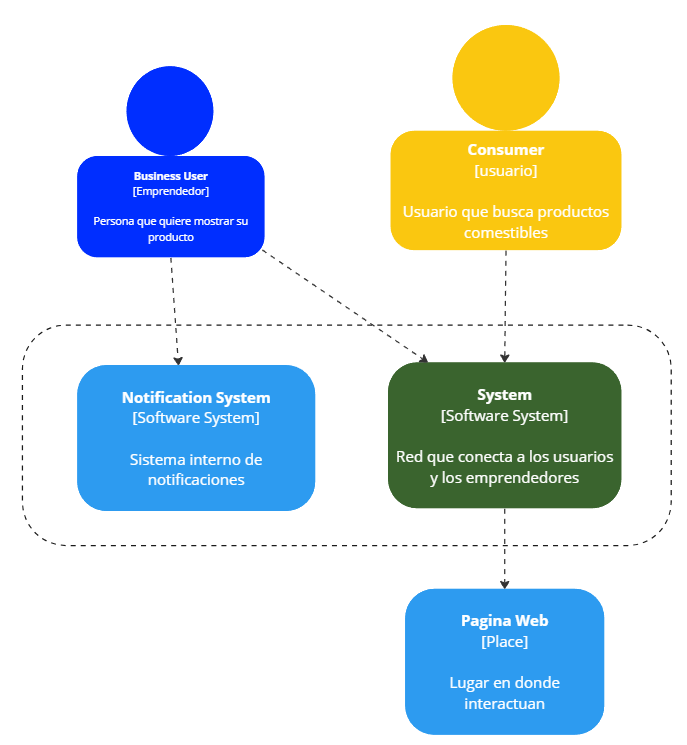
</p>

### 4.6.2. Software Architecture Container Diagram

En este diagrama de Software Architecture Container Diagrams se puede apreciar el funcionamiento que tendrá la aplicación y las relaciones con los bounded context correspondientes.

<p align="center">
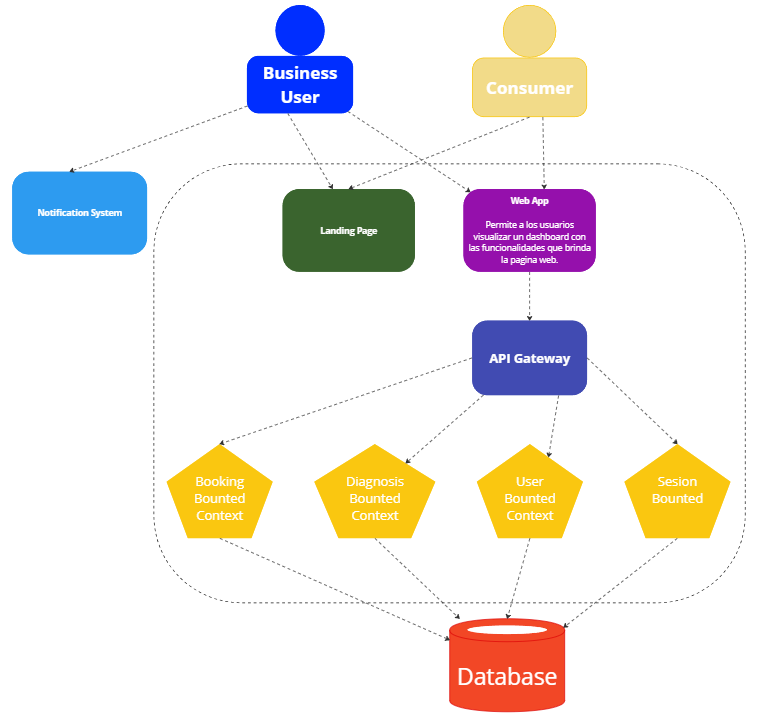
</p>

### 4.6.3. Software Architecture Components Diagram

En este diagrama de Software Architecture Components Diagrams se presenta de forma detallada las conexiones entre controllers, services y repositorios de las entidades que contiene el bounded context de Booking.

<p align="center">
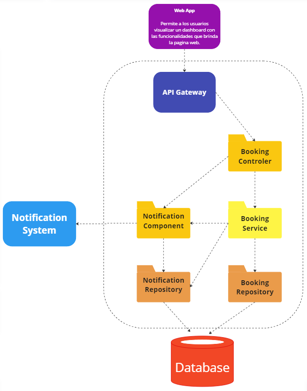
</p>

<br>

# 4.7. Software Object-Oriented Design
### 4.7.1. Class Diagrams

<div align='center'>

</div>
Link del [diagrama](https://lucid.app/lucidchart/746a28bd-1f42-4565-81cf-2a86911077ea/edit?viewport_loc=677%2C338%2C3400%2C1645%2CHWEp-vi-RSFO&invitationId=inv_3ab95094-ca4e-4133-804e-47e70973e471)

### 4.7.2. Class Dictionary

|Class|Description|
|-----|-----------|
|ID_Ruta|Identificador único para una ruta.|
|Direccion|Dirección relacionada con una ruta.|
|ID_Boleta|Identificador único para una boleta.|
|CantProductos|Cantidad de productos en una boleta.|
|DireccionProducto|Dirección de entrega de los productos en una boleta.|
|Pago|Método de pago utilizado en una boleta.|
|Ruc_Dni|Número de RUC o DNI relacionado con una boleta.|
|ID_Compras|Identificador único para una compra.|
|ListaCompras|Lista de productos comprados en una compra.|
|IDProducto|Identificador único para un producto.|
|FechaDeEmicion|Fecha de emisión de un producto.|
|FechaDeCaducidad|Fecha de caducidad de un producto.|
|IdTiendas|Identificador único para una tienda.|
|ClasesDeTienda|Clase o tipo de tienda.|
|IdMarca|Identificador único para una marca.|
|Tipo_Business|Tipo de negocio (emprendedor o empresa).|
|Id_Business|Identificador único para un negocio.|
|Name_Business|Nombre del negocio (emprendedor o empresa).|
|Ruc|Número de RUC relacionado con un negocio.|
|email_Business|Correo electrónico relacionado con un negocio.|
|celphone_Business|Número de teléfono relacionado con un negocio.|
|Password_Business|Contraseña relacionada con un negocio.|
|IdUsuario|Identificador único para un usuario.|
|email_user|Correo electrónico de un usuario.|
|celphone_user|Número de teléfono de un usuario.|
|NickName_user|Apodo o nombre de usuario de un usuario.|
|Password_user|Contraseña de un usuario.|
|IdPromocion|Identificador único para una promoción.|
|DatePromocion|Fecha de una promoción.|
|IdClaseUser|Identificador único para una clase de usuario.|
|DateClaseUser|Fecha de una clase de usuario.|

<br>

# 4.8. Database Design
### 4.8.1. Database Diagram