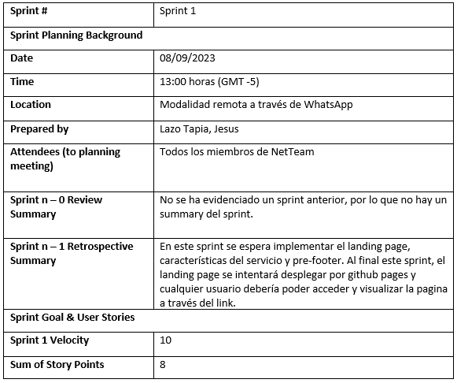
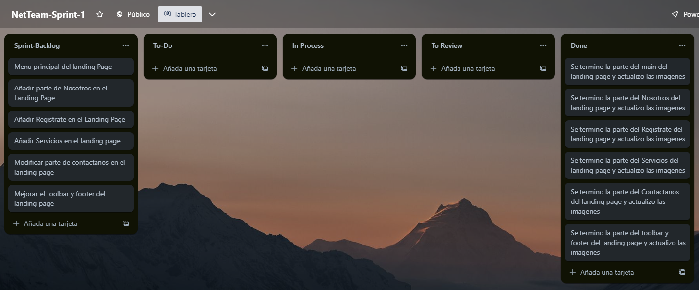
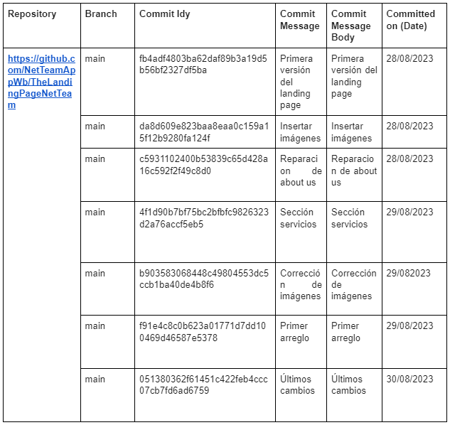
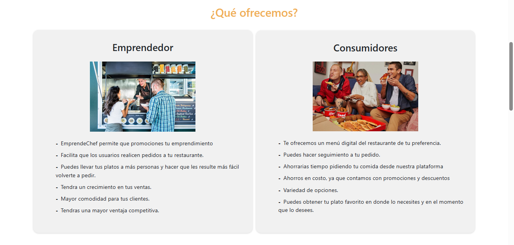
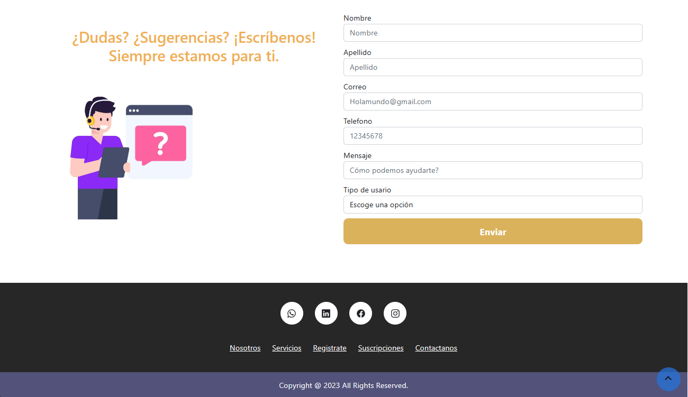
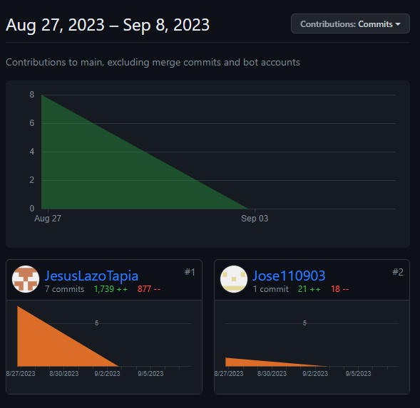
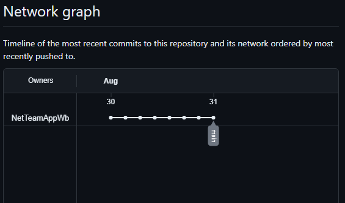

# 5.1. Software Configuration Management

### 5.1.1. Software Development Environment Configuration

A continuación se listará los productos software que se han utilizado para el desarrollo del proyecto:

**Project Management**

* WhatsApp (https://www.whatsapp.com/?lang=es )    
  WhatsApp han sido los medios principales de comunicación entre los miembros del grupo, hay pudimos llevar la organización de cada parte que realizaría los integrantes para el trabajo.

**Requirements Management**

* Trello ( https://trello.com/es )   
  Trello ha permitido la organización de tareas a realizar en el proyecto, además del desarrollo del product backlog.

**Product UX/UI Design**

* UXPressia (https://uxpressia.com/ )     
  Se utilizó UXPressia para el desarrollo de los diagramas user personas, user journey mapping, empathy mapping e impact map.   

* Color Space (https://mycolor.space/ )     
Color Space ha apoyado en la selección de la paleta de colores para el desarrollo del diseño de la web.

* Figma (https://www.figma.com/ )      
Se ha utilizado Figma para el desarrollo de los wireframes y prototipos del landing page y aplicación web, tanto en dispositivos de escritorio como de móvil.

* Miro (https://miro.com/es/ )           
Miro ha sido empleado en el desarrollo de los escenarios mapping y escenario mapping para ambos segmentos objetivos.

**Software Development**

* WebStorm, JetBrains Rider (https://www.jetbrains.com/es-es/webstorm/ ) (https://www.jetbrains.com/es-es/rider/ )       
  WebStorm y Rider que pertenecen a JetBrains fueron las IDEs que emplearemos para el desarrollo del código del proyecto. Hemos desarrollado el landing page con WebStorm, luego Rider se usará para la aplicación web.

* Github y Git bash  (https://github.com/ ) (https://git-scm.com/downloads )     
Github y Git bash nos permitirán el control de versiones del código y el desarrollo colaborativo del proyecto. 

**Software Testing**

* Google Chrome Developer (https://www.google.com/intl/es-419/chrome/dev/ )     
Se utilizó Google Chrome en la versión developer para visualizar la interfaz que desarrollamos el landing page.

**Software Deployment**

* Github Pages (https://github.com/ )     
Se utilizó Github Pages para el deploy del landing page.

**Software Documentation**

* Google Drive (https://www.google.com/intl/es-419_pe/drive/ )         
Se ha utilizado Google Drive para subir archivos de documentos y presentación. Además se han utilizado herramientas como Google Docs y Google Slides que permiten el desarrollo colaborativo de los informes a entregar.

* Google Meets (https://meet.google.com/ )    
Se ha utilizado software para videoconferencias para realizar las entrevistas de segmentos objetivos. Las plataformas tienen herramientas de grabación, por lo que simplifica el procesamiento de los videos.   

* Microsoft Stream (https://www.microsoft.com/es-ww/microsoft-365/microsoft-stream )      
Se ha utilizado el servicio de Microsoft Stream para subir el video completo de las entrevistas. La cuenta que ha subido el video está vinculada a la organización de la universidad, por lo que se tuvo suficiente espacio de memoria para mantenerlo en la nube. 

* LucidChart (https://www.lucidchart.com/pages/es )       
LucidChart ha sido empleado en el desarrollo de diagramas de flujo para asegurar los user goals y guiar en el diseño de los prototipos de la aplicación web. Además, se ha utilizado para el diagrama de clases. 

* Vertabelo (https://vertabelo.com/ )     
Para el desarrollo del diagrama del diseño de base de datos se ha empleado Vertabelo, software que se especializa en diagramas de base de datos.

### 5.1.2. Source Code Management

Se ha creado una organización en Github con los miembros del grupo y un repositorio para el landing page.

* Organización: https://github.com/NetTeamAppWb     
* Repositorio landing page: https://github.com/NetTeamAppWb/TheLandingPageNetTeam

### 5.1.3. Source Code Style Guide & Conventions

**Nomenclatura General**
 Los nombres de las variables, los objetos, los elementos y las funciones empleadas se les darán términos en inglés relevantes y pueden describir lo que representan. No se utilizan mayúsculas porque según W3Schools (s.f.) estas letras se ven mal mezcladas con minúsculas, además el uso privilegiado de minúsculas hace que el código sea más legible.

**Sangria**
Al usar HTML, CSS y/o JavaScript, se aplicará un espacio antes de cada línea dentro del bloque. Este espacio debe ser dos, y según W3Schools (s.f.) no se debe utilizar la tecla "tabulador".
Ejemplo de nomenclatura estándar de la sangría en HTML según W3Schools (s.f.):
*<cuerpo>
*  <cp>
*    <cr>Usuario</cr>
*    <cr>Cuenta</cr>
*  </cp>
*</cuerpo>
Ejemplo de nomenclatura estándar de la sangría en CSS según W3Schools (s.f.):
 html {
  font: #fff;
  color: #404;
}
Ejemplo de nomenclatura estándar de la sangría en JavaScript según W3Schools (s.f.):

 function toCelsius(fahrenheit) {
  return (5 / 9) * (fahrenheit - 32);
}

**Html**
Llamado así por el acrónimo del nombre en inglés HyperText Markup Language. HTML es un lenguaje de marcado que define la estructura de las páginas web. Además, tiene funciones que pueden determinar el comportamiento de diferentes partes del contenido de la página, como cambiar el tamaño del texto, aplicar cursiva, etc. Usaremos HTML5, y las características y pautas a seguir en el uso de este lenguaje son las siguientes:

* Declaración de tipos de archivos: El tipo de documento debe declararse en la primera línea de código. Según Google (s.f.), HTML5 es la mejor sintaxis para todos los documentos HTML, indicando que solo necesita copiar lo siguiente:

           <!DOCTYPE html>

* Multimedia Fallback: Garantice un acceso alternativo a los objetos multimedia en caso de que falle la carga. Además, según W3Schools (s.f.), se recomienda agregar las dimensiones del elemento, ya que de esta manera el navegador ahorra espacio que será utilizado antes de comenzar a cargar.
Ejemplo: 
 

**CSS**
Nombrado así por el acrónimo del nombre en inglés Cascading Style Sheets. CSS es un lenguaje de marcado enfocado en definir y mejorar la presentación de documentos basados en HTML. Las pautas a seguir al usar CSS son las siguientes:
* Shorthand Properties: Debe declarar los campos de elementos en la menor cantidad de líneas posible utilizando abreviaturas de propiedad. Según Google (s.f.), esto mejora la eficiencia del código y lo hace más fácil de entender. Nuevamente, debemos evitar colocar unidades después del valor cero.

* Declaration: Como la mayoría de los lenguajes de programación, debe colocar un punto y coma después de cada declaración. Según Google (s. f.). Esta característica ayuda a que el código sea más consistente.

* CSS Quotation Marks: No se deben usar comillas dobles (""), solo se permiten comillas simples ('') para uso exclusivo de selectores de atributos y valores de atributos.

**Javascript**
Es un lenguaje de programación que dicta exactamente lo que tiene que hacer el navegador, el orden de las tareas y el número de veces que debe realizarlas. Los signos de usar JavaScript en nuestro proyecto son los siguientes:

* Spaces around operators: Se debe colocar un espacio alrededor de cada operador matemático ingresado en el código. Esto también funciona con comas.

* Simple Statement´s End: Una declaración simple debe terminar con un punto y coma, como es el caso en muchos otros lenguajes de programación.

### 5.1.4. Software Deployment Configuration

 

# 5.2. Landing Page, Services & Applications Implementation

### 5.2.1. Sprint 1
### 5.2.1.1. Sprint Planning 1

### 5.2.1.2. Sprint Backlog 1

> [Enlace del board en Trello](https://trello.com/b/jXw9yhjl/netteam-sprint-1)

 

### 5.2.1.3. Development Evidence for Sprint Review

> [Enlace del github](https://github.com/orgs/NetTeamAppWb/repositories)

 

### 5.2.1.4. Testing Suite Evidence for Sprint Review

En el alcance del sprint 1, no se realizaron testing de la aplicación al haber solo trabajado en el landing page.  

### 5.2.1.5. Execution Evidence for Sprint Review.     
A continuación se presentan capturas del landing page implementado parcialmente en código, con el uso de HTML, CSS.  

 

### 5.2.1.6. Services Documentation Evidence for Sprint Review.        
En el alcance del presente sprint, no se han utilizado servicios de web ya que se ha trabajado solamente el landing page estático. Por lo tanto, en esta presentación no se encuentra documentación de web services empleados.

### 5.2.1.7. Software Deployment Evidence for Sprint Review.
Por el momento, no se ha utilizado servicios web para realizar el desarrollo del landing page, por lo que no se evidencian actividades de creación de cuentas, configuración de recursos en cloud providers, configuración de proyectos de desarrollo para integración o automatización de labor de Deployment, entre otros.

 

### 5.2.1.8. Team Collaboration Insights during Sprint

A continuacion se presentan capturas de los insights del repositorio del landing page en Github:

